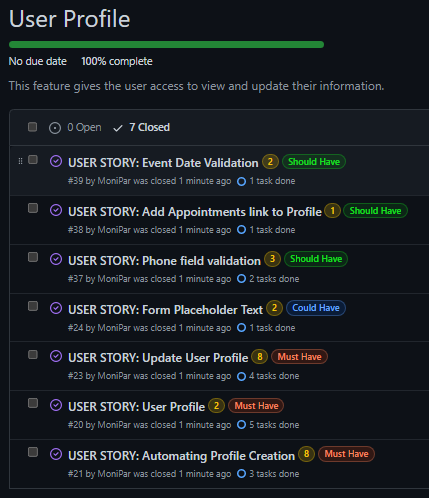

# TAILOR'S THIMBLE

Tailor's Thimble is a full-stack, responsive website built for a fictional tailoring business for educational purposes only.    

It provides the user value in learning about the business and the services it provides.  It has a booking facility which allows users to create an account, schedule, view, edit and delete appointments.  


[Link to the live website](https://tailors-thimbles.herokuapp.com/)

## Table of Contents
* [Overview](#overview)
* [Agile Methodology](#agile-methodology)
* [User Experience (UX)](#user-experience-ux)
    * [Strategy / Site Goals](#strategy--site-goals)
    * [Scope / User Stories](#scope--user-stories)
    * [Structure / Design Choices](#structure--design-choices)
    * [Skeleton / Wireframes](#skeleton--wireframes)
    * [Surface](#surface)
* [Features](#features)
    * [Existing Features](#existing-features)
    * [Future Features](#future-features)
* [Technologies Used](#technologies-used)
* [Testing](#testing)
    * [Development Bugs](#development-bugs)
    * [Bugs Remaining](#bugs-remaining)
* [Deployment](#deployment)
    * [Forking the GitHub Repository](#forking-the-github-repository)
    * [Creating a Local Clone](#creating-a-local-clone)
* [Credits](#credits)
* [Acknowledgements](#acknowledgements)

[Back To Top](#tailors-thimble)

____

## Overview

Tailor's Thimble is a responsive mobile-first build website.  It is compatible with all current major browsers.  The website is built for educational purposes, using Bootstrap and the Django Framework. It gives users the ability to register for an account, add their requirements in their profile and schedule appointments with the Master Tailor. It includes user authentication and full CRUD functionality on appointments.   

[Back To Top](#table-of-contents)

____

## Agile Methodology

The plan for this project was carried out using Agile Methodology. GitHub Issues, which can be viewed [here](https://github.com/MoniPar/tailors_thimble/issues), were used to record the User Stories. These were categorised into 9 Epics/Milestones and further labelled with story points using the [Fibonacci Sequence](https://www.mathsisfun.com/numbers/fibonacci-sequence.html). 

Each User Story contains Acceptance Criteria and Tasks which for lack of experience, I sometimes had to add after I did the process as I wasn't really sure what needed to be done to achieve the Acceptance Criteria needed.

Since this was my first project using this methodology and the Django framework, some of the estimated story points were way off. In practice, a few of these tasks were completed quicker than anticipated while others took much longer. 

The [MoSCoW Method of Prioritisation](https://www.agilebusiness.org/dsdm-project-framework/moscow-prioririsation.html) was also used, classifying each User Story as a 'Must Have', 'Should Have' or 'Could Have'. Some 'Could Have's didn't make it into the project and were left in the Backlog for a future date. 

I tried to keep the scope as minimal as possible for this project so any extra features that I had in mind, have not been added to the User Stories. It is important to note here, that by writing only enough User Stories to reach the MVP, my iterations were not as well balanced as recommended and they mostly consisted of 'Must Have's.    

<details>
<summary>Instance of Kanban Board and examples of an Epic and User Story</summary>

        Kanban Board at this Iteration


        Epic 1 - Setup


        Epic 2 - First Deployment


        Epic 3 - Home Page


        Epic 4 - Other Frontend


        Epic 5 - Admin Panel


        Epic 6 - User Registration & Authentication


        Epic 7 - Profile


        Epic 8 - Appointments


        Epic 9 - Testing & Documentation


        A User Story I am working on


</details>

As a whole, I found using the Agile Methodology of great benefit as it helped me organise the development of my project better.  Although I didn't give myself a specific duration for each iteration, it helped me also organise my time better. It also felt good to tick off the Tasks while working on a User Story and placing it in the 'Done' column when it was completed. 

[Back To Top](#table-of-contents)

____

## User Experience (UX)

### Strategy / Site Goals

Tailor's Thimble aims to entice and onboard potential clients.  It displays information about the small tailoring business and the type of services they offer, as well as the process they take on each individual garment. It provides information about the experience of the Master Tailor and provides potential and returning clients a way to easily schedule appointments for their bespoke process. 

The target audience are adults who need tailored garments for their occasions and/or for their children's occasions.  It is also aimed at business people who prefer to have original and uniquely tailored suits.  It is also suited for professionals in need of formal wear and businesses which require staff uniforms.   

### Scope / User Stories

This section aims to determine what a user would expect from interacting with the website. Each User Story was recorded in GitHub Issues as noted in the [Agile Methodology](#agile-methodology) section above.  Scenarios of actions each type of user including the business owner wishes to take are listed below. These were categorised into 9 Epics listed in the [Agile Methodoly](#agile-methodology) section, for the development of the project.

**As a Business Owner**

* I would like users visiting our site to land on the homepage so that they can learn about us and the services we provide.
* I would like the homepage to have a Call to Action so that users are encouraged to schedule an appointment early on.
* I can display some of the services we provide on the Homepage so that it gives the user an idea of the type of services we offer.
* I can login, view customers' information and appointments scheduled so that I can contact them back for approval/dismissal.


**As a User**

* I can see the website's logo and links at the top of the page so that I can easily navigate to other parts of the website.
* I can see contact details, shop address and social links at the bottom of the website so that I can follow/contact the business owner and the website creator.
* I can learn about the people behind the business so that I can make up my mind if I would feel comfortable using their service.
* I can easily navigate to the About page so that I can find more detailed information about the people behind the business and how they operate.
* I can easily navigate to the Services page so that I can find more information about the kind of work the business caters for.
* I can register an account so that I can make an appointment with the Master Tailor.
* I can update my profile information so that I can change my details when necessary.

**As a Returning User**

* I can use my username and password so that I can login to my user account.
* I can log out of my account so that I can keep my details secure.
* I can login to my profile so that I can access my information and view my details.

**As a Developer**

* I can add a favicon to the tab with website's title so that it gives users more visual feedback when looking at their tabs on their browser. 
* I can display success and error messages upon form submission so that the user has a better experience with the site. 
* I can automate user profile creation upon registration so that the admin doesn't have to do it manually every time a new user is registered.
* I can have placeholder text in the profile form so that users have a better experience filling in their forms.

### Structure / Design Choices
### Skeleton / Wireframes
### Surface

[Back To Top](#table-of-contents)

____

## Features

### Existing Features
### Future Features

[Back To Top](#table-of-contents)

____

## Technologies Used

### Languages

* [HTML5](https://www.w3schools.com/html/)
* [CSS3](https://www.w3schools.com/css/css_intro.asp)
* [Python](https://www.python.org/downloads/release/python-3811/)

### Libraries & Frameworks

* [Django 3.2.18](https://www.djangoproject.com/) - Free and open source Python Web Framework.
* [Gunicorn 20.1.0](https://gunicorn.org/) - A Python WSGI HTTP server compatible with Django and used to run the project on Heroku.
* [PostgreSQL 0.5.0](https://www.postgresql.org/) - A powerful, open-source object-relational database system.
* [Pyscopg2 2.9.5](https://www.psycopg.org/docs/) - A PostgreSQL database adapter for Python.
* [Cloudinary](https://cloudinary.com/) - A persistent file store for media.
* [Heroku](https://www.heroku.com) - A cloud platform as a service.
* [SQLite3](https://docs.python.org/3/library/sqlite3.html) - The database provided by Django, used during development.
* [Bootstrap 4.6.2](https://getbootstrap.com/docs/4.6/getting-started/introduction/) - A Framework for building responsive, mobile-fist sites.
* [Crispy Forms](https://django-crispy-forms.readthedocs.io/en/latest/) - Provides a |crispy filter and  tag that helps control the rendering behavior of Django forms in a very elegant and DRY way. 

### Tools

* [W3C Validator](https://validator.w3.org/) - A validator which checks the markup validity of Web documents in HTML, XHTML, SMIL, MathML, etc.
* [W3C CSS Validation Service](https://jigsaw.w3.org/css-validator/) - A validator which checks the validity of CSS code. 
* [Code Institute's Python Linter](https://pep8ci.herokuapp.com/) - Highlights syntactical and stylistic problems in Python source code.
* [Autoprefixer CSS Online](https://autoprefixer.github.io/) - A PostCSS plugin which parses CSS and adds vendor prefixes. 
* [Am I responsive](https://ui.dev/amiresponsive) - For responsive visuals of the website
* [TinyPNG](https://tinypng.com/) - Compresses images to reduce the file size
* [TinyURL](https://tinyurl.com/app/) - Shortens links
* [Pexels](https://www.pexels.com/) - Stock Photos
* [Unsplash](https://unsplash.com/) - Stock Photos 
* [BrowserStack](https://www.browserstack.com/) - App and Browser Testing


[Back To Top](#table-of-contents)

____

## Testing

All testing information can be found in [TESTING.md](TESTING.md).

[Back To Top](#table-of-contents)

____

## Bugs

<details>
<summary>First Deployment Bug</summary>

Problem: When the skeleton project was complete and first deployment was tried on Heroku, the Build Log stated "https://tailors-thimbles.herokuapp.com/ deployed to Heroku", however when the "Open App" button was clicked the django success page did not load.  Instead a "Not Found The requested resource was not found on this server".

Solution: After unsuccessful web searches, some settings were reconfigured in settings.py. I narrowed down the cause to either of the following two factors:
**Factor 1** 
```
DEBUG = 'DEVELOPMENT' in os.environ
```
was changed back to `DEBUG = True` and removed from env.py

**Factor 2**
```
TEMPLATES = [
    'DIRS': os.path.join(BASE_DIR, 'templates')
]
```
was changed to: 

```
TEMPLATES_DIR = os.path.join(BASE_DIR, "templates")
TEMPLATES = [
    ...
    'DIRS': [TEMPLATES_DIR], 
    ...
]
```

</details>

<details>
<summary>Development Bugs</summary>

* **Django-allauth**

Problem: Django-allauth was installed and configured and the allauth directory was copied into the base templates file within a folder called 'allauth'.  When the 'signin' and 'signup' templates were edited, no change was being rendered. The base.html file wasn't being extended either as the pages showed without the website's navigation and footer.  

Solution: The templates directory in settings.py had to be configured back to how it was before First Deployment.
```
...
'DIRS': [
            os.path.join(BASE_DIR, 'templates'),
            os.path.join(BASE_DIR, 'templates', 'allauth')
        ],
...
```
and the following was again removed from the top of settings.py
```
TEMPLATES = [
    'DIRS': os.path.join(BASE_DIR, 'templates')
]
```
Hoping that this won't be problematic when the project is deployed again!

**Note**: This did not cause any problems during Final Deployment.

* **Crispy Forms**

Problem: After installing and configuring Crispy and adding it to the template.  The following error was being thrown.

Solution: A new version of Crispy has come out so it was installed with `pip3 install crispy-bootstrap5` and the following were added in settings.py.
```
INSTALLED_APPS = (
    ...
    'crispy_forms',
    'crispy_bootstrap5',
    ...
)

CRISPY_ALLOWED_TEMPLATE_PACKS = "bootstrap5"
CRISPY_TEMPLATE_PACK = "bootstrap5"
```

* **Appointments**

    * Human Readable Choices

        Problem: Calling the "human-readable" value of the field CHOICES with the following, in either models.py or views.py wasn't working:
        ```
        def __str__(self):
            return self.get_type_display() 
        ```
        Solution: The only way it worked was by using `{{ appointment.get_type_display }}` in the template. 

    * Passing Choices to forms.py

        Problem: In order to override the ModelForm for the CreateView in `forms.py` to make the Custom AppointmentCreate form, the constants/sequences for the 'type' and 'time' choicefields had to be passed to `forms.py`. Various ways were tried in doing so: First, by copying and pasting the sequences into the `forms.py` file. This worked but there was a lot of repeated code between the `models.py` and `forms.py` files.  A second attempt was tried by removing them from the `models.py` file altogether and doing migrations again without the `choices=CHOICES` argument in the 'type'and 'time' fields.  This also worked, however I wasn't too sure this was the correct way of doing things especially when [Django Documentation](https://docs.djangoproject.com/en/4.1/ref/models/fields/#field-choices) recommends that they should be defined in the Model Class.

        Solution: Eventually, I came about a solution in [this Slack thread](https://code-institute-room.slack.com/archives/C026PTF46F5/p1676326871471269), which recommended to create a `constants.py` file and adding the constants to it then importing them to wherever they were needed.     


    * **Navbar**

        * Active Tag on Bootstrap with Django 

        Problem: The navbar active class was not working.  The active class should be applied to each link when clicked but I could see in devTools that it was stuck on home. 
        
        Solution: From the search I conducted I understood that because we are requesting the page as a url in django, we need to specify this request. The best way I found that made sense to me was to use 'if statements' in the base template itself.  This [Stackoverflow question](https://stackoverflow.com/questions/32931436/active-tag-on-bootstrap-with-django) suggested to check if the URL matches using `request.resolver_match.url_name`.  This is not a very DRY solution but it worked.  The following code shows how to add it to the home page link - it needs to be done so for each link in the navbar.
        ```
        <li class="nav-item active">
            <a class="nav-link" href="">Home<span class="sr-only">(current)</span></a>
        </li>
        ```

</details>

<details>
<summary>Bugs encountered during Testing</summary>

* **Services Images**

    Problem: At screen sizes > 1200px images are not scaling up equally. I have checked that all images have the same classes, and tried adding some media queries with width specified, however the problem persists and can't pinpoint why this is happening.  This is effecting the images to center properly on the page. 
    
    Possible Solution: I will need to re-write this section in order to make them scale up equally.  Possibly using flex-grow or having an image srcset to size up the images at the different screen size.
    
    Solved: Due to another bug I noticed during responsiveness testing, I managed to solve this by giving them a larger column width at the different breakpoints and removing the 'row' element they were in.  This gave each of the columns an equal width and the images were then allowed to scale up equally.

* **Horizontal Scroll**
    
    Problem: While testing responsiveness, I noticed that on certain devices there was some horizontal scroll on the pages which gave the navbar a wider width than the page itself.  This made the navbar-toggler and the right-side links move too much to the right. At first I thought it was a problem with the navbar, however it worked perfectly on the Home page.  So I decided that the problem must be within the pages themselves.

    Solution: Using a process of elimination, I commented out one by one the divs on the About page to start with.  Eventually, I found out the culprit to this issue which was the `<div>` with the row class.  When I removed this `<div>`, the horizontal scroll vanished and the nav-toggler was back in it's rightful space.  The parent of the row `<div>` was as by Bootstrap's recommendations a `<div>` with a container class.  However, I had added a custom class with this container to add padding at the top and bottom of the container. Resulting in the following:

    

    I only realised this mistake after I had gone through all the pages and deleted the row `<div>`. What I should have probably done was use the bootstrap's container to add the top and bottom padding. Because of time contraints I opted to leave things as they were this time and note this here for future referral.  

    **Signup redirect**

    Problem: While testing User Story [#16](https://github.com/MoniPar/tailors_thimble/issues/16), I discovered that after new user gets through signup via the Schedule Appointment button, they were being directed to the Appointments Page rather than the Profile page. 
    Solution: I tried using `ACCOUNT_SIGNUP_REDIRECT_URL = '/profile/'` in settings.py, however this didn't seem to work.  After a quick search online, I came across this [thread](https://groups.google.com/g/django-users/c/7xEk0HOj_-E), which said to change it directly from the signup template by removing the if statement from this code
    ```
    
        <input type="hidden" name="{{ redirect_field_name }}" value="{{ redirect_field_value }}" />
    
    ```
    and substituting the value of value in the input element with `/profile/`.  This worked and users registering via the appointment button are now directed to the Profile page after submitting their signup form. 

</details>

<details>
<summary>Bugs Remaining</summary>

### Bugs Remaining

* **Profile**

    * Phone field validation

    Problem: Issue with this regex `^[+][0-9\\s]+` is that it lets more than one whitespace in so user can submit a number like this "+33     333".  
    Temporary solution: After several searches and attempts at moving the '\\s' around, I decided to go with no white space at all and used `^[+][0-9]+`.
    Re-edit: Some users reported problems submitting their Profile form because it wasn't accepting their phone number.  This was because they were not putting in the + symbol.  I eventually added a tool tip to remind them to enter the + symbol followed by the country code and phone number.  I found another phone number regex [here](https://uibakery.io/regex-library/phone-number-python) which left the + symbol as optional. I adapted it to this `^\\+?[1-9][0-9]{10,17}$` which should be enough for most European numbers and definitely for Maltese numbers.  Eventually, I will look into adding an external module for a phone number field in order to take international numbers but for now this is hopefully enough.


</details>


[Back To Top](#table-of-contents)

____

## Deployment

For good practice, this project was deployed early to [Heroku](https://www.heroku.com) in order to save time and avoid nasty surprises later on.

After installing Django and the supporting libraries, the basic Django project was created and migrated to the database. 

The database provided by Django [db.sqlite3](https://docs.python.org/3/library/sqlite3.html) is only accessible within the workspace environment. In order for Heroku to be able to access the database, a new database suitable for production needs to be created.  Heroku offers a postgres add-on at an extra charge. I am using a postgreSQL database instance hosted on [ElephantSQL](https://www.elephantsql.com/) as this service is free. 

<details>
<summary>Steps taken before deploying the project to Heroku</summary>

### Create the Heroku App

1. Login to Heroku and click on the top right button ‘New’ on the dashboard. 
2. Click ‘Create new app’.
3. Give your app a unique name and select the region closest to you. 
4. Click on the ‘Create app’ button.

### Create the PostgreSQL Database

1. Login to ElephantSQL and click on the top right button ‘Create New Instance’.
2. Give your plan the name of the project and select the Tiny Turtle (Free) plan.  The ‘Tags’ field can be left empty.  
3. Click on ‘Select Region’ and select a data centre near you and click ‘Review’.  
4. Make sure your plan is correct and click ‘Create Instance’. 
5. Return to the dashboard and click on this project’s instance you just created. This will open up the “Details” page where the link to the URL is displayed.  This needs to be added to the env.py file in the project’s directories.

### Create the env.py file

With the database created, it now needs to be connected with the project.  Certain variables need to be kept private and should not be published to GitHub.  

1. In order to keep these variables hidden, it is important to create an env.py file and add it to .gitignore.  
2. At the top **import os** and set the DATABASE_URL variable using the `os.environ` method. Add the URL copied from instance created above to it, like so:
`os.environ[“DATABASE_URL”] = ”copiedURL”`
3. The Django application requires a SECRET_KEY to encrypt session cookies.  Set this variable to any string you like or generate a secret key on this [MiniWebTool](https://miniwebtool.com/django-secret-key-generator/).
`os.environ[“SECRET_KEY”] = ”longSecretString”`

### Modify settings.py 

It is important to make the Django project awa
re of the env.py file and to connect the workspace to the new database. 

1. Open up the settings.py file and add the following code. The if statement acts as a safety net for the application in case it is run without the env.py file.
```
import os
import dj_database_url

if os.path.isfile(‘env.py’):
    import env
```
2. Remove the insecure secret key provided by Django and reference the variable set in the env.py file earlier, like so:
```
SECRET_KEY = os.environ.get(‘SECRET_KEY’)
```
3. You can leave DEBUG as True or set it to `'DEVELOPMENT' in os.environ` and then add the following to the env.py file:
```
os.environ["DEVELOPMENT"] = "True"
```
4. Hook up the database using the dj_database_url import added above.  The original DATABASES variable provided by Django connects the Django application to the created db.sqlite3 database within your repo.  This database is not suitable for production so add the following conditional to tell Django to use the external database if there is one or to use the local sqlite version if not. 
```
if 'DATABASE_URL' in os.environ:
    DATABASES = {
        'default': dj_database_url.parse(os.environ.get('DATABASE_URL'))
    }
else:
    DATABASES = {
        'default': {
            'ENGINE': 'django.db.backends.sqlite3',
            'NAME': os.path.join(BASE_DIR, 'db.sqlite3'),
        }
    }
```

**NOTE**: If at the start of the development you are using the local db.sqlite3, make sure to add it to the .gitignore file, so as not to make the mistake of pushing it to your repository. 

5. Save and migrate this database structure to the newly connected postgreSQL database.  Run the migrate command in your terminal
`python3 manage.py migrate`
6. To make sure the application is now connected to the remote database hosted on ElephantSQL, head over to your ElephantSQL dashboard and select the newly created database instance. Select the ‘Browser’ tab on the left and click on ‘Table queries’.  This displays a dropdown field with the database structure which has been populated from the Django migrations. 

### Connect the Database to Heroku

1. Open up the Heroku dashboard, select the project’s app and click on the ‘Settings’ tab.
2. Click on ‘Reveal Config Vars’ and add the DATABASE_URL with the value of the copied URL from the database instance created on ElephantSQL.
3. Also add the SECRET_KEY with the value of the secret key added to the env.py file. 
4. If using gitpod another key needs to be added in order for the deployment to succeed.  This is PORT with the value of 8000.

### Cloudinary Setup

1. Go to your [Cloudinary](https://cloudinary.com) account's dashboard and click on the ‘API environment variable’ to copy to clipboard.  This is used to connect your app to your Cloudinary account.  Add this to the env.py file in your workspace using CLOUDINARY_URL as the variable name.  Remember to remove the first part of the URL (CLOUDINARY_URL=) as this will give you a failed deployment.  
2. Copy and paste this value into the Heroku config vars with the key CLOUDINARY_URL.
3. In Heroku add one more temporary variable to help get the project deployed without static files.  This needs to be removed before deploying the full project.  Use DISABLE_COLLECTSTATIC as the key and ‘1’ as the value.
4. Go to settings.py and add the Cloudinary libraries in the list of INSTALLED_APPS.  Place ‘cloudinary_storage’ above the ‘django.contrib.staticfiles’ and ‘cloudinary’ just above the main app.
5. Scroll down the the STATIC_URL variable and add the following to instruct Django to use Cloudinary to store media and static files.
```
STATICFILES_STORAGE = ‘cloudinary_storage.storage.StaticHashedCloudinaryStorage’
STATICFILES_DIRS = [os.path.join(BASE_DIR, ‘static’)]
STATIC_ROOT = os.path.join(BASE_DIR, ‘staticfiles’)

MEDIA_URL = ‘/media/’
DEFAULT_FILE_STORAGE = ‘cloudinary_storage.storage.MediaHashedCloudinaryStorage’
```

### Setup the Templates Directory

In settings.py, add the following under BASE_DIR 
`TEMPLATES_DIR = os.path.join(BASE_DIR, "templates")`
then scroll down to the TEMPLATES variable and add the following to the value of DIRS:
```
'DIRS': [TEMPLATES_DIR],
```

### Add the Heroku Host Name

In settings.py scroll to ALLOWED_HOSTS and add the Heroku host name.  This should be the Heroku app name created earlier followed by `.herokuapp.com`.  Add in `’localhost’` so that it can be run locally.
```
ALLOWED_HOSTS = [‘heroku-app-name.herokuapp.com’, ‘localhost’]
```

### Create the Directories and the Process File

1. Create the media, static and templates directories at the top level next to the manage.py file. 
2. At the same level create a new file called ‘Procfile’ with a capital ‘P’.  This tells Heroku how to run this project.  
3. Add the following code, including the name of your project directory. 
```
web: gunicorn tailors_thimble.wsgi
```
* ‘web’ tells Heroku that this a process that should accept HTTP traffic.
* ‘gunicorn’ is the server used.
* ‘wsgi’, stands for web services gateway interface and is a standard that allows Python services to integrate with web servers.
4. Save everything and push to GitHub. 

</details>

<details>
<summary>First Deployment</summary>

### First Deployment

1. Go back to the Heroku dashboard and click on the ‘Deploy’ tab.  
2. For deployment method, select ‘GitHub’ and search for the project’s repository from the list. 
3. Select and then click on ‘Deploy Branch’.  
4. When the build log is complete it should say that the app has been successfully deployed.
5. Click on the ‘Open App’ button to view it and the Django “The install worked successfully!” page, should be displayed. 

</details>

<details>
<summary>Final Deployment</summary>

### Final Deployment

1. When development is complete, if you had left `DEBUG = True` in the settings.py file, make sure to change it to `False`. You don't have to change anything if you had used `DEBUG = 'DEVELOPMENT' in os.environ` as your env.py file is ignored by GitHub. 
2. Commit and push your code to your project's repository.
3. Then open up Heroku, navigate to your project's app. Click on the 'settings' tab, open up the config vars and delete the DISABLE_COLLECTSTATIC variable. 
4. Navigate to the 'Deploy' tab and scroll down to 'Deploy a GitHub branch'.
5. Select the branch you want to deploy and click on the 'Deploy branch' button. When the app is deployed, you should see a message in the built log saying "Your app was successfully deployed".  Click 'View' to see the deployed app in the browser. Alternatively, you can click on the 'Open App' button at the top of the page. 

</details>

_____

### Forking the GitHub Repository

<details>
<summary>Steps to Fork the GitHub Repository</summary>

Forking allows you to view and edit the code without affecting the original repository

1. Locate the GitHub repository. Link to this repository can be found [here](https://github.com/MoniPar/tailors_thimble).
2. Click on 'Fork', in the top right-hand corner.
3. This will take you to your own repository to a fork with the same name as the original branch.

</details>

_____

### Creating a Local Clone

<details>
<summary>Steps to Creating a Local Clone</summary>

1. Go to the GitHub repository. Link to this repository can be found [here](https://github.com/MoniPar/tailors_thimble).
2. Click on 'Code' to the right of the screen. This will open a dropdown. Click on HTTPs and copy the link.
3. Open Git Bash in your IDE and change the current working directory to the location where you want the cloned directory.
4. Type `git clone`, paste the URL you copied earlier, and press Enter to create your local clone.

More information on Creating and Managing repositories can be found [here](https://docs.github.com/en/repositories/creating-and-managing-repositories/cloning-a-repository)
<br>

</details>

[Back To Top](#table-of-contents)

____

## Credits

### Code

The following walkthroughs helped me get my project in shape.  I have adapted the code in these walkthroughs for the needs of my project.
* Code Institute's "I Think Therefore I Am Blog" which is found in the CI's LMS for the Diploma in Software Development.
* Corey Schafer's [Python Django Tutorial: Full-Featured Web App](https://www.youtube.com/watch?v=UmljXZIypDc)
* John Abdsho Khosrowabadi [Django Tutorial On How To Create A Booking System For A Health Clinic](https://blog.devgenius.io/django-tutorial-on-how-to-create-a-booking-system-for-a-health-clinic-9b1920fc2b78) 

The following are links to the snippets of code I borrowed and adapted (cited in my project's folders):
* Clean Date function in tailoring/forms.py adapted from [Stackoverflow](https://tinyurl.com/sm6mu2bv)
* Footer adapted from [Responsive Bootstrap Footer by idesignSMF](https://tinyurl.com/3wrta8p5)

Pages I referred to a lot:

* [Django Documentation](https://docs.djangoproject.com/en/3.2/)
* [Bootstrap Documentation](https://getbootstrap.com/docs/4.6/getting-started/introduction/)

Other pages/questions I found useful:

* Active Tag on Bootstrap with Django [Stackoverflow Question](https://stackoverflow.com/questions/32931436/active-tag-on-bootstrap-with-django)
* Change button active colour in Bootstrap 4 [Stackoverflow Question](https://stackoverflow.com/questions/49911051/how-to-change-button-active-color-in-bootstrap-4)
* Validating Date 30 days into the future [Stackoverflow Question](https://tinyurl.com/yc6fcep4)
* Linking an anchor tag in another page[Stackoverflow Question](https://stackoverflow.com/questions/31643670/link-a-div-in-another-page-in-url-with-an-anchor-tag-django)
* Dynamic Page Titles [Forge](https://www.forgepackages.com/guides/page-titles/)
* HTML Form Enctype Attribute [GeeksForGeeks](https://www.geeksforgeeks.org/html-form-enctype-attribute/)
* Django QuerySet Field Lookups[W3Schools](https://www.w3schools.com/django/django_ref_field_lookups.php)

### Media

* Tailor's Thimble logo and favicon designed by [Austen Donohoe | Circle Strafe Media](https://www.circlestrafemedia.com/)
* Home Page Hero Image [Heng Films | Unsplash](https://unsplash.com/@hengfilms)
* About CTA Image [Анна Хазова | Pexels](https://www.pexels.com/photo/happy-friends-and-newlywed-couple-celebrating-wedding-at-night-5005252/)
* Formal Suits Photo [Juan Vargas | Pexels](https://www.pexels.com/photo/man-in-gray-suit-standing-beside-woman-in-green-dress-3664688/)
* Fancy Dress Photo [JJ Jordan | Pexels](https://www.pexels.com/photo/man-and-woman-2447192/)
* Graduation Gown Photo Photo [RODNAE Productions | Pexels](https://www.pexels.com/photo/a-man-wearing-black-toga-holding-rolled-certificate-while-smiling-at-the-camera-7713194/)
* Tailor Images [Tima Miroshnichenko | Pexels](https://www.pexels.com/collections/tailor-lzw9l6f/)
* Other Tailor Images [Anna Shvets | Pexels](https://www.pexels.com/photo/a-man-sitting-and-sewing-a-fabric-on-a-wooden-table-5830690/)
* Services Wedding Photo [Євгенія Височина](https://unsplash.com/@eugenivy_now?utm_source=unsplash&utm_medium=referral&utm_content=creditCopyText) on [Unsplash](https://unsplash.com/s/photos/wedding-couple?utm_source=unsplash&utm_medium=referral&utm_content=creditCopyText)
* Evening Wear Photo [Chalo Garcia](https://unsplash.com/es/@photosbychalo?utm_source=unsplash&utm_medium=referral&utm_content=creditCopyText) on [Unsplash](https://unsplash.com/s/photos/cocktail-dress?utm_source=unsplash&utm_medium=referral&utm_content=creditCopyText)
* Girl in Communion Dress Photo [Becerra Govea Photo](https://www.pexels.com/photo/a-pretty-girl-in-white-dress-leaning-on-the-wall-5906115/)
* Profile page header image [Artem Podrez | Pexels](https://www.pexels.com/photo/wrinkled-silk-cloth-7232394/)
* Profile page header image [Anete Lusina | Pexels](https://www.pexels.com/photo/background-of-smooth-rippled-brown-silk-fabric-6331032/)

[Back To Top](#table-of-contents)

____

## Acknowledgements


[Back To Top](#table-of-contents)

____