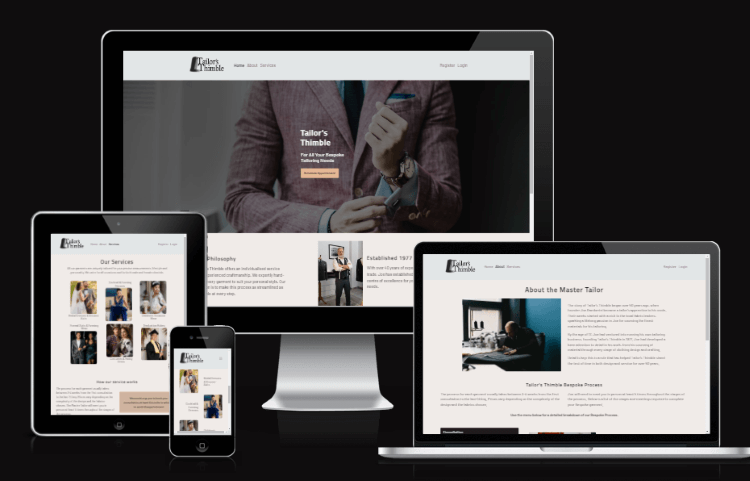
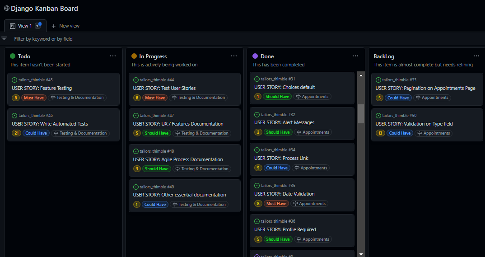
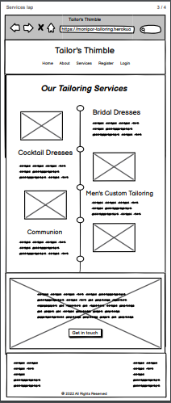
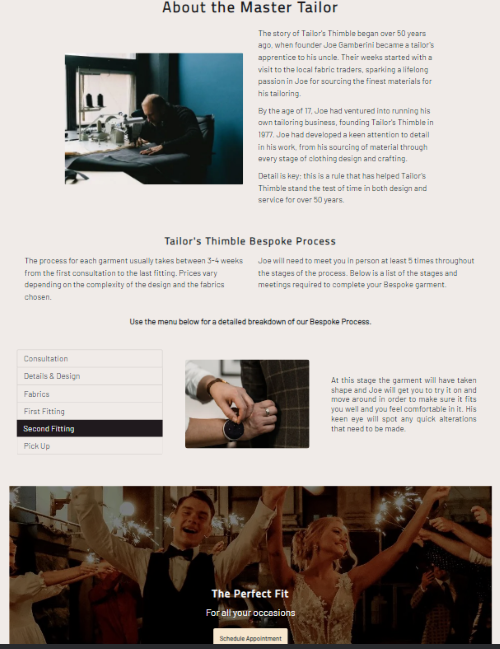
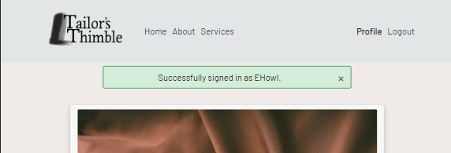
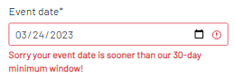
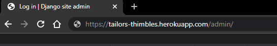

# TAILOR'S THIMBLE

Tailor's Thimble is a full-stack, responsive website built for a fictional tailoring business for educational purposes only.    

It provides the user value in learning about the business and the services it provides.  It has a booking facility which allows users to create an account and then schedule, view, edit and delete appointments.  



[Link to the live website](https://tailors-thimbles.herokuapp.com/)

## Table of Contents
* [Overview](#overview)
* [Agile Methodology](#agile-methodology)
* [User Experience (UX)](#user-experience-ux)
    * [Strategy / Site Goals](#strategy--site-goals)
    * [Scope / User Stories](#scope--user-stories)
    * [Structure / Design Choices](#structure--design-choices)
    * [Skeleton / Wireframes](#skeleton--wireframes)
    * [Surface](#surface)
* [Features](#features)
    * [Existing Features](#existing-features)
    * [Future Features](#future-features)
* [Technologies Used](#technologies-used)
* [Testing](#testing)
* [Bugs](#bugs)
* [Deployment](#deployment)
    * [Forking the GitHub Repository](#forking-the-github-repository)
    * [Creating a Local Clone](#creating-a-local-clone)
* [Credits](#credits)
* [Acknowledgements](#acknowledgements)

[Back To Top](#tailors-thimble)

____

## Overview

Tailor's Thimble is a responsive, mobile-first build website.  It is compatible with all current major browsers.  The website is built for educational purposes, using Bootstrap and the Django Framework. It gives users the ability to register for an account, add their requirements in their profile, and schedule appointments with the Master Tailor. It includes role-based permissions and full CRUD functionality on appointments.   

[Back To Top](#table-of-contents)

____

## Agile Methodology

The plan for this project was carried out using Agile Methodology. GitHub Issues, which can be viewed [here](https://github.com/MoniPar/tailors_thimble/issues), were used to record the User Stories. These were categorised into 9 Epics/Milestones and further labelled with story points using the [Fibonacci Sequence](https://www.mathsisfun.com/numbers/fibonacci-sequence.html). 

Each User Story contains Acceptance Criteria and Tasks which I sometimes had to add after I did the process, as I wasn't yet sure what needed to be done to achieve the Acceptance Criteria I aimed for.

Since this was my first project using this methodology and the Django framework, some of the estimated story points were way off. In practice, a few of these tasks were completed faster than anticipated, while others took much longer. 

The [MoSCoW Method of Prioritisation](https://www.agilebusiness.org/dsdm-project-framework/moscow-prioririsation.html) was also used, classifying each User Story as a 'Must Have', 'Should Have' or 'Could Have'. Some 'Could Have's didn't make it into the project and were left in the Backlog for a future iteration. It is important to note here, that by writing only enough User Stories to reach the Minimum Viable Product(MVP), 'Won't Have' wasn't included as a category at this time.    

<details>
<summary>Instance of Kanban Board, screenshots of Epics and User Story</summary>

        Kanban Board at this Iteration


        Epic 1 - Setup


        Epic 2 - First Deployment


        Epic 3 - Home Page


        Epic 4 - Other Frontend


        Epic 5 - Admin Panel


        Epic 6 - User Registration & Authentication


        Epic 7 - Profile


        Epic 8 - Appointments


        Epic 9 - Testing & Documentation


        A User Story I am working on


</details>

As a whole, I found using the Agile Methodology of great benefit as it helped me to better organise the development of my project.  Although I didn't give myself a specific duration for each iteration, it helped me to also manage my time better. It also felt good to tick off the Tasks while working on a User Story and placing it in the 'Done' column when it was completed. 

[Back To Top](#table-of-contents)

____

## User Experience (UX)

### Strategy / Site Goals

Tailor's Thimble aims to entice and onboard potential clients.  It displays information about the small tailoring business and the type of services they offer, as well as the process they take on each individual garment. It provides information about the experience of the Master Tailor and provides potential and returning clients a way to easily schedule appointments for their bespoke process. 

The target audience are adults who need tailored garments for their occasions and/or for their children's occasions. It is also suited for professionals in need of formal wear and businesses which require staff uniforms.   

___

### Scope / User Stories

This section aims to determine what a user would expect from interacting with the website. Each User Story was recorded in [GitHub Issues](https://github.com/MoniPar/tailors_thimble/issues).  Scenarios of actions each type of user, including the business owner, wishes to take are listed below. These were categorised into 6 Epics listed in the [Agile Methodology](#agile-methodology) section, for the development of the project. Developer User Stories were also added to this section. 

**As a Business Owner**

* I would like users visiting our site to land on the homepage so that they can learn about us and the services we provide. [#6](https://github.com/MoniPar/tailors_thimble/issues/6) 
* I would like the homepage to have a Call to Action so that users are encouraged to schedule an appointment early on. [#9](https://github.com/MoniPar/tailors_thimble/issues/9)
* I can display some of the services we provide on the Homepage so that it gives the user an idea of the type of services we offer. [#11](https://github.com/MoniPar/tailors_thimble/issues/11)
* I have access to the database so that I can manage customers' details and appointments. [#15](https://github.com/MoniPar/tailors_thimble/issues/15)
*  I can login and view appointments scheduled by my customers so that I can contact them back for approval/dismissal. [#25](https://github.com/MoniPar/tailors_thimble/issues/25)


**As a User**

* I can see the website's logo and links at the top of the page so that I can easily navigate to other parts of the website. [#7](https://github.com/MoniPar/tailors_thimble/issues/7)
* I can see contact details, shop address and social links at the bottom of the website so that I can follow/contact the business owner and the website creator. [#8](https://github.com/MoniPar/tailors_thimble/issues/8)
* I can learn about the people behind the business so that I can make up my mind if I would feel comfortable using their service. [#10](https://github.com/MoniPar/tailors_thimble/issues/10)
* I can easily navigate to the About page so that I can find more detailed information about the people behind the business and how they operate. [#13](https://github.com/MoniPar/tailors_thimble/issues/13) 
* I can easily navigate to the Services page so that I can find more information about the kind of work the business caters for. [#14](https://github.com/MoniPar/tailors_thimble/issues/14)
* I can register an account so that I can make an appointment with the Master Tailor. [#16](https://github.com/MoniPar/tailors_thimble/issues/16)


**As a Returning User**

* I can use my username and password so that I can login to my user account. [#17](https://github.com/MoniPar/tailors_thimble/issues/17)
* I can log out of my account so that I can keep my details secure. [#18](https://github.com/MoniPar/tailors_thimble/issues/18)
* I can log in to my profile so that I can access my information and view my details. [#19](https://github.com/MoniPar/tailors_thimble/issues/19)
* I can update my profile information so that I can change my details when necessary. [#23](https://github.com/MoniPar/tailors_thimble/issues/23)
* I can schedule an appointment with the Master Tailor so that I can avail of their service. [#27](https://github.com/MoniPar/tailors_thimble/issues/27)
* I can view my appointments so that I can check if my appointments have been approved. [#26](https://github.com/MoniPar/tailors_thimble/issues/26)
* I can update my appointment so that I can make sure of my availability. [#28](https://github.com/MoniPar/tailors_thimble/issues/28)
* I can delete my upcoming appointment so that I can reschedule at a later date. [#29](https://github.com/MoniPar/tailors_thimble/issues/29)

The following User Stories were used to implement features which make the website run more smoothly and give the users a better experience using the website. 

**As a Developer**

* I can add a favicon to the tab with website's title so that it gives users more visual feedback when looking at their tabs on their browser. [#12](https://github.com/MoniPar/tailors_thimble/issues/12) 
* I can display success and error messages upon form submission so that the user has a better experience with the site. [#22](https://github.com/MoniPar/tailors_thimble/issues/22)
* I can automate user profile creation upon registration so that the admin doesn't have to do it manually every time a new user is registered. [#21](https://github.com/MoniPar/tailors_thimble/issues/21)
* I can have placeholder text in the profile form so that users have a better experience filling in their forms. [#24](https://github.com/MoniPar/tailors_thimble/issues/24)
* I can direct the user to enter a country code so that they can be reached even if they live abroad. [#37](https://github.com/MoniPar/tailors_thimble/issues/37)
* I can restrict access on users' appointments so that only the logged in user and admin are able to access, update and delete said user's appointments. [#30](https://github.com/MoniPar/tailors_thimble/issues/30)
* I can add an empty default choice in the Create Appointment form so that the user is alerted when trying to submit an appointment without selecting the type and time. [#31](https://github.com/MoniPar/tailors_thimble/issues/31)
* I can place validations on the datefield so that users are not allowed to pick dates in the past and dates/times that have already been booked. [#35](https://github.com/MoniPar/tailors_thimble/issues/35)
* I can restrict users from adding an appointment before they add their profile information so that the business owner is able to access the profile information before confirming their appointment. [#36](https://github.com/MoniPar/tailors_thimble/issues/36)

___

### Structure / Design Choices

The website offers simplicity and consistency within its structure.  Its structure was designed to be responsive on screens from 320px up to 2560px. 

The Navigation menu displays the Tailor's Thimble logo and a Hamburger button (on mobile) with links to the Home, About, Services, Registration and Login pages, for easy navigation. The Navigation menu is repeated across all pages including, the Profile Page and the Appointment Booking Pages. 

The Footer displays social media links which open in a separate tab for ease of use. It also displays the shop's address, the opening hours and other means of contact. The footer is also repeated across all pages to keep the design uniform and for ease of access.

The Home Page clearly delineates the purpose of the site with a large Hero which consists of the name of the business, a slogan and a call to action button.  Other information on the page is concise and links to the other pages of the website. 

The About Page gives a more detailed description of the Master Tailor and the process he uses for his craft.  Images are used to illustrate the information specified in a neat and organised manner. Likewise, the Services Page, illustrates the types of services the business offers and redirects the users to the About Page for detailed information on the process used. Another call to action is displayed on both pages to encourage users to use the service.

The Registration & Authentication Pages, also accessed through the Navigation Menu, welcome the users to the service and are simple, clear and conform with the standards used across the web. 

The Profile Page, which is only available to registered users, acts also as a dashboard, where users can view and update their information.  It links up with the users Appointments Page via the Appointments button.

The Appointments Page, can be reached through the Profile Page or through the Schedule Appointment button on the Home, About and Services Pages.  It lists the Appointments scheduled by the user.  It also has an Add Appointment button which links to the Create Appointment form. Each appointment is displayed as a card, with information about the appointment and a button for a more detailed view.  The detailed view provides means to update and delete the appointment.  

<details>

<summary>The Database Schema used for this project</summary>


Two custom models have been implemented in this project. 

* **The Profile Model** has a one-to-one relationship with the Django's User Model and consists of:

    - profile_id (PK)
    - user_id (FK)
    - first_name
    - last_name
    - email
    - phone
    - event
    - event_date
    - outfit_type

* **The Appointment Model** has a one-to-many relationship with the Django's User Model and consists of:

    - appointment_id (PK)
    - user_id (FK)
    - type
    - date
    - time
    - comments
    - submitted
    - approved

</details>

<br>
___

### Skeleton / Wireframes

Wireframes were first sketched with pen and paper. This method helped me with brainstorming, deciding the most essential parts for the website and getting a feel for the website as a whole. They were then wireframed in [Balsamiq](https://balsamiq.com/wireframes/) to give a closer indication of the design.  Through the design phase some elements were changed to allow for a better user experience.

<details>

<summary>Balsamiq Wireframes</summary>

**Home**


**About**


**Services**




**Register**


**Login**


**Logout**


**Profile**


**Appointments**


**Create Appointment**


**View Appointment**


**Delete Appointment**


</details>


[Right click for Mobile Wireframes pdf](documentation/wireframes_mobile.pdf)

[Right click for Desktop Wireframes pdf](documentation/wireframes_laptop.pdf)

___

### Surface

This section defines the visual language of the website.

* Colour Scheme

A Champagne and Black colour palette was chosen for this website. The combination with hues of brown and the sophistication of white is used to create a stylish look that gives the feel of luxury.  


[Canva](https://www.canva.com/colors/color-palette-generator/) was used to generate the above palette.

Black was used for the footer and the text.  It was also used to create contrast for the Bespoke Process Menu links on the About page.

Pewter was used for the Navigation. It is a very light and pretty shade of gray which created good contrast against the hero image on the Home page.

Champagne and hues of brown were used for the buttons, making them jump out against the darker images and the white background of the cards respectively.

* Typography

[Google Fonts](https://fonts.google.com/) Barlow and Titillium Web were used to create this website.  They are both sans-serif fonts and offer high-readability.

* Icons

[Font Awesome](https://fontawesome.com/) social media icons were used for the Footer.  They are used as interactive links and have an aria-label which gives the relevant information to screen readers to read out to the users. 


[Back To Top](#table-of-contents)

____

## Features

### Existing Features

**Header & Navigation**

Featured on all pages, the fully responsive header includes:

* A link on the Logo which brings the user to the home page.
* A hamburger button on mobile which opens up a navigation list with links to the Home, About, Services, Register and Login pages. This helps reduce the clutter on the header by keeping the page links neatly stowed away until the user navigates to the hamburger button. The links have a hover and focus effect to help the user identify them as links.
* Links to the Home, About, Services, Register and Login pages on tablet and desktop which help the user to navigate easily from page to page, without having to revert back to the previous page via the back button. The link to the current page is darker to help the user identify the page they are on.
* The last two links change depending on the user's status. If the user is not logged, in the Register and Login links are displayed, while the Profile and Logout links are displayed if the user is logged in.
* The header is fixed to the top so that the user always has access to the navigation links.

<details>

<summary>Click to view screenshots of Navigation features</summary>

        Navigation closed on mobile  


        Navigation open on mobile


        Navigation open for logged user mobile


        Navigation on tablets & desktops


        Navigation for logged user on tablets & desktops


</details>

<br>

**Footer**

Featured on all pages, the responsive footer is valuable to the users as it encourages them to get in touch via phone or email if they prefer that method of contact and it also allows the users to keep connected via social media. It includes:
* The business's address and a small table with opening hours.
* Contact details are links which direct the user to the relevant apps. On mobile, the telephone number when clicked will bring up a call feature, while the email address will open up an email app on tablet or desktop as well.
* Social links open in a new tab so that users are not directed away from the website. 
* Copyright has a link to the creator's LinkedIn page, which also opens in a new tab.
* All links have a hover and focus effect to help users identify them as links.
* All links are labelled so that Screen readers are able to read them.

<details>

<summary>Click to view screenshots of Footer features</summary>

        Footer on mobile with hover on phone number


        Footer on iPhone 6S with call feature


        Footer on tablet with focus on facebook and hover on twitter icons


        Footer on desktop with focus on email and hover on copyright link


</details>

<br>

**Landing Page**

The Home page hero on the Landing page takes up more than half the viewport of any screen size. It includes a background image of a model wearing a suit with a an overlay of the business name and a slogan which captures the essence of the tailoring business.  It also acts a Call to Action(CTA) as it includes a bright button inviting the user to schedule an appointment.  The button has a hover and focus effect as demonstrated below. 

<details>

<summary>Click to view screenshots Landing page features</summary>

        Landing page on mobile


        Landing page on tablet with hover effect


        Landing page on desktop with focus effect


</details>

<br>

**Home Page Content**

The Home page displays further content which gives the user an outline of what this business is about. It includes:
* Information on the Philosophy of the business with a mission statement.
* A brief introduction to the Master Tailor with an image for tablets and desktops.
* A sample of the services the business caters for with images corresponding to the type of service.
* Links to find out more about the Master Tailor and the services offered are also included which direct the user to the About and the Services pages respectively. These links become underlined when in focus or are hovered on, in order to let the user know that they are links.

<details>

<summary>Click to view screenshots of other Home page content</summary>

        Home content on mobile


        Home content on tablet


        Home content on laptop


</details>

<br>

**About Page**

The responsive About page is reachable via the About link in the navigation bar as well as the link on the Home page 'Established' section. It includes the following:
* More detailed information about the Master Tailor and an image of him in his workshop.  This helps a potential customer find out the level of experience the craftsman has.  It helps build a level of trust in the tailor's ability to complete a very well accomplished service.
* A section on the process that the Tailor takes for every individual garment. The 6 steps of the process are accessible through an interactive menu which displays each step at a time. Each display includes an image and a paragraph on what happens at every step of the process. This feature is valuable to the user as it demonstrates the order for the appointments to be scheduled in order to complete a bespoke outfit.
* A CTA with a celebratory background image, inviting text and a champagne coloured button to entice the user to schedule an appointment.

<details>

<summary>Click to view screenshots of the About page</summary>

        About section on mobile


        The Bespoke Process section on mobile


        CTA on mobile


        About section on tablet


        Process and CTA on tablet


        About page on laptop


</details>

<br>

**Services Page**

The responsive Services page is reachable via the Services link in the navigation as well as via the 'Our Services' section on the Home page.  It includes the following:
* A section on some of the services provided by the business, displayed with images and titles. This gives the user proof of the variety of outfits the tailor can craft. They can admire his work through the images.
* A brief section on how the service works with a link to the Bespoke Process on the About page. Once again the user is informed on the process taken for each outfit. It is briefly repeated here in case they missed it on the About page. This section also includes a highlighted note which urges customers to book their first appointment early.  
* A CTA with a celebratory background image, inviting text and a champagne coloured button to entice the user to schedule an appointment.

<details>

<summary>Click to view screenshots of the Services page</summary>

        Our Services on mobile


        How the service works on mobile


        Our Services on tablet


        How the service works on tablet


        Services page on desktop


</details>

<br>

**Registration**

The website has the functionality for a user to register for an account.  
* The fully responsive registration form can be accessed through the navigation bar or through the Schedule Appointment button on the Home, About and Services pages.  
* It includes a small welcome message and reminds the first time user of the free consultation appointment. 
* At the bottom it also has a link to the Login form for users who have already registered for an account. The link has a focus and hover effect. 
* It uses django-allauth to provide all the settings for user authentication and includes the fields below.  The form was extended to also include fields for first and last name.

    - Email
    - Username (unique)
    - First Name
    - Last Name
    - Password
    - Password repeat

* The Register page's styles are consistent with the rest of the website.  The form is submitted via the Register button at the bottom of the form. This button provides good contrast against the white background of the form.
* When the users click on the Register button they are directed to the Profile page.
* An alert message is displayed on the screen giving the user feedback about their registration.

<details>

<summary>Click to view screenshots</summary>


</details>

<br>

**Login**

A returning user can access the login form through the navigation bar or through the Schedule Appointment button on the Home, About and Services pages.  
* It includes a small welcome back message and a link to the Registration form for users who have not yet registered for an account.
* It uses django-allauth to provide all the settings for user authentication and includes the following fields:  

    - Username
    - Password

* The responsive Login page is styled in a consistent manner with the rest of the website.  The form is submitted via the Login button at the bottom of the form. This button provides good contrast against the white background of the form.
* When users click on the Login button they are directed to the Profile page.
* An alert message is displayed at the top of the page giving the user feedback on their login.

<details>

<summary>Click to view screenshots</summary>




</details>

<br>

**Logout**

The website has functionality for a logged in user to log out.
* The Logout form can only be accessed from the navigation bar and only when the user is logged in.
* It confirms with the logged in user that they want to log out.
* Its style is consistent with the rest of the webpage and it is fully responsive.
* The Log Out button logs out the users and directs them back to the Home page. An alert message is displayed on the screen giving the user feedback on their logout. 

<details>

<summary>Click to view screenshots</summary>


</details>

<br>

**Profile**

The website gives the user the functionality to add information about their request through the Profile page.
* A user must be logged in to access the Profile page.  The link is displayed on the navigation bar for the logged in user.
* The Profile page lists information already gathered from the registration form. 
* The style is consistent with the rest of the webpage and it is fully responsive.
* It also consists of a form which has required fields for the following:
    
    - phone
    - event
    - event date
    - outfit type

* All fields have placeholders to guide the users in filling in the correct information.
* The phone field has some basic validation which only accepts digits and a + symbol. It also has a tooltip to aid the user in filling in their phone number in the correct format.
* The date field only accepts dates 30 days from today in order to allow enough time for the Bespoke process.
* If the information entered does not pass validation, the Update button directs the user back to the Profile page.  Error messages or tooltips point out the fields not passed and an error alert is displayed on the top of the screen. 
* If the information entered passes validation, the Update button directs the user back to the Home page. An alert message is displayed on the screen giving the user feedback on their successful update.
* The next time the returning user visits their Profile page, the fields are pre-populated with the information they have entered and updated previously.
* Logged in users can access their Appointments by clicking the Appointments button at the bottom of the Profile page.

<details>

<summary>Click to view screenshots</summary>

        Profile Page on tablet


        Profile unsuccessful alert 


        Phonefield invalid tooltip


        Datefield invalid error message


        Profile updated success alert


        Profile Page Pre-populated for returning users


</details>

<br>

**Appointments**

The website gives the user the functionality to create, view, update and delete appointments. All appointments are listed on the Appointments page.
* A user must be logged in to access the Appointments page. If a user who is not logged in, clicks on the Schedule Appointment button on the Home, About, and Services pages, they are directed to the login page.
* A logged in user can access the Appointments page through the Schedule Appointment button on the Home, About, and Services pages.  They can also access this page via the Appointments button on the Profile page. 
* The style for the Appointment page is consistent with the rest of the webpage and it is fully responsive.
* A logged in user who has not yet created an appointment will have a welcoming message with some information on how to add an appointment.
* Appointment cards are displayed in order of date of appointment for users who have already scheduled appointments. 
* The Appointments page has an Add Appointment button which will open the Create Appointment form.

<details>

<summary>Click to view screenshots</summary>

        Appointments page with no appointments


        Appointments page with appointments on phone


        Appointments page with appointments on tablet


        Appointments page with appointments on desktop


</details>

<br>

**Create Appointment**

The website gives the user the functionality to create an appointment via the Add Appointment button on the Appointments page.
* A user must be logged in to access the Appointment Create page.
* If a logged in user tries to add an appointment without first filling in the Profile form, they will get a notice directing them to first fill in the request form on their Profile page.  A link to their Profile page is included in the notice.  
* The Appointment Create page includes some information and a link to the Bespoke Process defined on the About page. This opens in a new tab, so that the user is not led away from the Appointment Create page. 
* The style is consistent with the rest of the webpage and it is fully responsive.
* The form on the page consists of required fields for the following:
    
    - Type
    - Date
    - Time
    - Comments (optional)

* The Type and Time fields are dropdown fields, from which the user can select a value.
* The Type field lists the 6 types of appointments needed to complete the Bespoke Process. 
* The Date field only accepts dates later than 24 hours from now, dates that fall on Tuesdays, Wednesdays, Thursdays and Saturdays and dates that haven't already been booked out.
* The Time field lists the 5 available times and is also validated along with the Date field so that it doesn't accept double bookings.
* If the information entered does not pass validation, the Submit button directs the user back to the form.  Error messages point out the fields not passed and an error alert is displayed on the top of the screen. 
* If the information entered passes validation, the Submit button directs the user back to the Appointments page, where they can view their newly created appointment. An alert message is displayed on the screen giving the user feedback on their successful creation.
* The Appointments Create page also features a Back to Appointments button which directs the user back to the Appointments page.

<details>

<summary>Click to view screenshots</summary>

        No profile information notice with hovered on link


        Appointment Create Page


        Datefield Validation - at least 24hrs 


        Datefield Validation - only Tue - Sat


        DateTime Validation - already booked


        Appointment create - error alert


        Appointment create - success alert


</details>

<br>

**View Appointment**

The website gives the user the functionality to read more details about their appointments via the View Appointment button on each appointment card in the Appointments page.
* A user must be logged in to access the Appointment Detail page.
* If a logged in user tries to access some other appointment that is not theirs through the URL, they get a 'Forbidden 403' page or an 'Error 404' if the appointment has been deleted.
* When the user clicks on the View Appointment button on the appointment card in the Appointments page, they are directed to that specific Appointment's Detail page.
* This consists of a card and a Back to Appointments button which directs the user back to the Appointment page. 
* The Appointment Detail card includes:
  - the Appointment Type, 
  - the Date & Time of appointment, 
  - some information about its approval, 
  - a message about rescheduling, 
  - an Update and a Delete button.
* The information on the appointments approval changes between approved or not yet approved. View screenshots below for details. 
* The style is consistent with the rest of the webpage and it is fully responsive.  All buttons have focus and hover effects.

<details>

<summary>Click to view screenshots</summary>

        Hovered View Appointment button on Appointment Card


        Appointment Detail card not yet approved


        Appointment Detail card approved


</details>

<br>

**Update Appointment**

The website gives the user the functionality to edit an appointment via the Update button on the Appointment Detail card.
* A user must be logged in to access the Appointment Update page.
* If a logged in user tries to update somebody else's appointment, they will get a 'Forbidden 403' page.  
* The Appointment Update page contains the Edit Appointment form and a Back to Appointments button.
* The style is consistent with the rest of the webpage and it is fully responsive.
* The form on the page consists of pre-populated required fields for the following:
    
    - Type
    - Date
    - Time
    - Comments (optional)

* The Type and Time fields are dropdown fields, from which the user can select a value.
* The Type field lists the 6 types of appointments needed to complete the Bespoke Process. 
* The Date field only accepts dates later than 24 hours from now, dates that fall on Tuesdays, Wednesdays, Thursdays and Saturdays and dates that haven't already been booked out.
* The Time field lists the 5 available times and is also validated along with the Date field so that it doesn't accept double bookings.
* If the information entered does not pass validation, the Update button directs the user back to the form.  Error messages point out the fields not passed and an error alert is displayed on the top of the screen. 
* If the information entered passes validation, the Update button directs the user back to the Appointments page, where they can view their newly updated appointment. An alert message is displayed on the screen giving the user feedback on their successful update.

<details>

<summary>Click to view screenshots</summary>

        Appointment Update Page on mobile


        Datefield Validation - at least 24hrs 


        Datefield Validation - only Tue - Sat


        DateTime Validation - already booked


        Appointment update - error alert


        Appointment update - success alert


</details>

<br>

**Delete Appointment**

The website gives the user the functionality to delete an appointment via the Delete button on the Appointment Detail card.
* A user must be logged in to access the Appointment Delete page.
* If a logged in user tries to delete somebody else's appointment, they will get a 'Forbidden 403' page.  
* The Appointment Delete page contains the Delete Appointment Card.
* The style is consistent with the rest of the webpage and it is fully responsive.
* The user is asked to confirm if they want to delete the appointment.
* They can confirm deletion by clicking the Yes, Delete button which redirects them back to the Appointments Page.  A message is displayed telling the user that their appointment has been successfully deleted.
* Or they can cancel the deletion by clicking on the Cancel button which will bring them back to the Appointment Detail page.  

<details>

<summary>Click to view screenshots</summary>

        Appointment Delete Page


        Appointment Deletion Alert Message


</details>

<br>

**Admin Panel**

The website offers the business owner the functionality to view and interact with the database in the Django Admin panel.
* The panel is reachable by typing `/admin/` at the end of the website's URL in the URL bar.
* This brings the user to the Django Administration Login Page, where the user is asked for their Username and Password.  Only users with Superuser status and staff status are given permissions to login. 
* The Superuser has permissions to add, change, delete and view everything while the user with the status of staff has only certain permissions granted by the Superuser.
* The Tailor has been granted the Superuser status for now, in order to have full access of the Admin's Panel. 
* The registered project's models can be viewed in the Admin Interface where tables for Appointments and Profiles are listed under the relevant app names. Accounts and Authentication & Authorisation list tables with information gathered through registration.  

* The Superuser is able to search the Profile table by:
        
    - username (typing in any string of letters in the right order will give a match e.g. "min" will bring up Admin, HarryRosmini etc.) 

    - date (searched in this format yyyy-mm-dd. e.g. "2024" will bring up all profiles with event dates for 2024, "2024-01" will bring up all profiles with event dates for January 2024 etc.) 
        
* Using the menu on the far right, the Superuser is also able to filter this table by:

    - username
    - event
    - event date

* The Superuser is able to search the Appointments table by:

    - username (same as above)
    - type (the type of appointment is searched by its constant:
        - "con" for consultation
        - "dd" for details & design
        - "fab" for fabrics
        - "ff" for first fitting
        - "sf" for second fitting
        - "pu" for pickup)

    - date (this is the date scheduled for the appointment and is searched in this format like above: yyyy-mm-dd)

* Using the menu on the far right, the Superuser is also able to filter this table by:

    - date
    - type
    - approved

<details>

<summary>Click to view screenshots</summary>

        Reaching the Admin Panel


        Django Administration Login Page


        Django Administration Interface


        Django Administration Interface for Appointments


</details>

<br>

**403, 404, 500 Pages**

These templates were added to this project in order to give the user the functionality to return to the website by using the links in the navigation bar or the Back to Homepage button at the bottom of the page.
* They are triggered when a user tries to access:
    
    - information that is not theirs - 403,
    - information that does not exist anymore - 404,
    - something has gone wrong with the server and cannot retrieve database - 500

* The styles are consistent with the rest of the website and are also responsive.

<details>

<summary>Click to view screenshots</summary>

        Forbidden 403 page


        Error 404 page


</details>

<br>

[Back To Top](#table-of-contents)
____

### Future Features

* Validation on Appointment Type field - At the moment a user can select any type of appointment in the wrong order and each type can be selected more than once. This will need to be set up so that users can only select each type once and in the right order for every Bespoke process.
* Pagination on Appointments Page - This will need to be revisited depending on how the Business owner decides to deal with completed processes.  At the moment all appointments are listed in the Appointments page and ordered by date.  
* Change Profile to Request or Dashboard - Some users found the Profile page confusing as its functionality is not exactly the kind that they are used to. 
* Add Testimonials Section - Give the users the functionality to add Testimonials to the page, preferably with images, so that other users can read them and get a better idea of the standard of work the business offers.
* Add modal to Process link on Create Appointment page.
* A Contact Page with contact form.
* Email or phone verification
* Forgot/Reset password functionality
* Welcome, appointment reminder, texts or emails.

[Back To Top](#table-of-contents)

____

## Technologies Used

### Languages

* [HTML5](https://www.w3schools.com/html/)
* [CSS3](https://www.w3schools.com/css/css_intro.asp)
* [Python](https://www.python.org/downloads/release/python-3811/)

### Libraries & Frameworks

* [Django 3.2.18](https://www.djangoproject.com/) - Free and open source Python Web Framework
* [Gunicorn 20.1.0](https://gunicorn.org/) - A Python WSGI HTTP server compatible with Django and used to run the project on Heroku
* [PostgreSQL 0.5.0](https://www.postgresql.org/) - A powerful, open-source object-relational database system
* [Pyscopg2 2.9.5](https://www.psycopg.org/docs/) - A PostgreSQL database adapter for Python
* [Cloudinary](https://cloudinary.com/) - A persistent file store for media
* [Heroku](https://www.heroku.com) - A cloud platform as a service
* [ElephantSQL](https://www.elephantsql.com/) - PostgreSQL database hosting service
* [SQLite3](https://docs.python.org/3/library/sqlite3.html) - The database provided by Django
* [Django Allauth](https://django-allauth.readthedocs.io/en/latest/) - Integrated set of Django applications addressing authentication and registration
* [Bootstrap 4.6.2](https://getbootstrap.com/docs/4.6/getting-started/introduction/) - A Framework for building responsive, mobile-fist sites
* [Crispy Forms](https://django-crispy-forms.readthedocs.io/en/latest/) - Provides a |crispy filter and  tag that helps control the rendering behavior of Django forms in a very elegant and DRY way 

### Tools

* [GitPod](https://www.gitpod.io/) - Cloud development environment used
* [GitHub](https://github.com/) - Cloud based git repository used
* [W3C Validator](https://validator.w3.org/) - A validator which checks the markup validity of Web documents in HTML, XHTML, SMIL, MathML, etc.
* [W3C CSS Validation Service](https://jigsaw.w3.org/css-validator/) - A validator which checks the validity of CSS code
* [Code Institute's Python Linter](https://pep8ci.herokuapp.com/) - Highlights syntactical and stylistic problems in Python source code
* [Chrome DevTools and Lighthouse](https://developer.chrome.com/docs/devtools/) - Web Developer Tools
* [Autoprefixer CSS Online](https://autoprefixer.github.io/) - A PostCSS plugin which parses CSS and adds vendor prefixes 
* [Am I responsive](https://ui.dev/amiresponsive) - For responsive visuals of the website
* [CanIUse](https://caniuse.com/) - Browser support tables for modern web technologies
* [TinyPNG](https://tinypng.com/) - Compresses images to reduce the file size
* [TinyURL](https://tinyurl.com/app/) - Shortens links
* [Pexels](https://www.pexels.com/) - Stock Photos
* [Unsplash](https://unsplash.com/) - Stock Photos 
* [Canva](https://www.canva.com/colors/color-palette-generator/) - Colour Palette Generator
* [Google Fonts](https://fonts.google.com/) - Fonts
* [Font Awesome](https://fontawesome.com/) - Icons
* [Balsamiq](https://balsamiq.com/wireframes/) - Low Fidelity Wireframes
* [LucidChart](https://www.lucidchart.com/) - Entity Relationship Diagram
* [BrowserStack](https://www.browserstack.com/) - App and Browser Testing


[Back To Top](#table-of-contents)

____

## Testing

All testing information can be found in [TESTING.md](TESTING.md).

[Back To Top](#table-of-contents)

____

### Bugs

<details>
<summary>First Deployment Bug</summary>

Problem: When the skeleton project was complete and first deployment was tried on Heroku, the Build Log stated "https://tailors-thimbles.herokuapp.com/ deployed to Heroku", however when the "Open App" button was clicked the django success page did not load.  Instead a "Not Found The requested resource was not found on this server".

Solution: After unsuccessful web searches, some settings were reconfigured in settings.py. I narrowed down the cause to either of the following two factors:
**Factor 1** 
```
DEBUG = 'DEVELOPMENT' in os.environ
```
was changed back to `DEBUG = True` and removed from env.py

**Factor 2**
```
TEMPLATES = [
    'DIRS': os.path.join(BASE_DIR, 'templates')
]
```
was changed to: 

```
TEMPLATES_DIR = os.path.join(BASE_DIR, "templates")
TEMPLATES = [
    ...
    'DIRS': [TEMPLATES_DIR], 
    ...
]
```

</details>

<details>
<summary>Development Bugs</summary>

* **Django-allauth**

Problem: Django-allauth was installed and configured and the allauth directory was copied into the base templates file within a folder called 'allauth'.  When the 'signin' and 'signup' templates were edited, no change was being rendered. The base.html file wasn't being extended either as the pages showed without the website's navigation and footer.  

Solution: The templates directory in settings.py had to be configured back to how it was before First Deployment.
```
...
'DIRS': [
            os.path.join(BASE_DIR, 'templates'),
            os.path.join(BASE_DIR, 'templates', 'allauth')
        ],
...
```
and the following was again removed from the top of settings.py
```
TEMPLATES = [
    'DIRS': os.path.join(BASE_DIR, 'templates')
]
```
Hoping that this won't be problematic when the project is deployed again!

**Note**: This did not cause any problems during Final Deployment.

* **Crispy Forms**

Problem: After installing and configuring Crispy and adding it to the template.  The following error was being thrown.

Solution: A new version of Crispy has come out so it was installed with `pip3 install crispy-bootstrap5` and the following were added in settings.py.
```
INSTALLED_APPS = (
    ...
    'crispy_forms',
    'crispy_bootstrap5',
    ...
)

CRISPY_ALLOWED_TEMPLATE_PACKS = "bootstrap5"
CRISPY_TEMPLATE_PACK = "bootstrap5"
```

* **Appointments**

    * Human Readable Choices

        Problem: Calling the "human-readable" value of the field CHOICES with the following, in either models.py or views.py wasn't working:
        ```
        def __str__(self):
            return self.get_type_display() 
        ```
        Solution: The only way it worked was by using `{{ appointment.get_type_display }}` in the template. 

    * Passing Choices to forms.py

        Problem: In order to override the ModelForm for the CreateView in `forms.py` to make the Custom AppointmentCreate form, the constants/sequences for the 'type' and 'time' choicefields had to be passed to `forms.py`. Various ways were tried in doing so: First, by copying and pasting the sequences into the `forms.py` file. This worked but there was a lot of repeated code between the `models.py` and `forms.py` files.  A second attempt was tried by removing them from the `models.py` file altogether and doing migrations again without the `choices=CHOICES` argument in the 'type'and 'time' fields.  This also worked, however I wasn't too sure this was the correct way of doing things especially when [Django Documentation](https://docs.djangoproject.com/en/4.1/ref/models/fields/#field-choices) recommends that they should be defined in the Model Class.

        Solution: Eventually, I came across a solution in [this Slack thread](https://code-institute-room.slack.com/archives/C026PTF46F5/p1676326871471269), which recommended creating a `constants.py` file and adding the constants to it, then importing them to wherever they were needed.     


    * **Navbar**

        * Active Tag on Bootstrap with Django 

        Problem: The navbar active class was not working.  The active class should be applied to each link when clicked but I could see in devTools that it was stuck on home. 
        
        Solution: From the search I conducted I understood that because we are requesting the page as a url in django, we need to specify this request. The best way I found that made sense to me was to use 'if statements' in the base template itself.  This [Stackoverflow question](https://stackoverflow.com/questions/32931436/active-tag-on-bootstrap-with-django) suggested to check if the URL matches using `request.resolver_match.url_name`.  This is not a very DRY solution but it worked.  The following code shows how to add it to the home page link - it needs to be done like so for each link in the navbar.
        ```
        <li class="nav-item active">
            <a class="nav-link" href="">Home<span class="sr-only">(current)</span></a>
        </li>
        ```

</details>

<details>
<summary>Bugs encountered during Testing</summary>

* **Services Images**

    Problem: At screen sizes > 1200px images are not scaling up equally. I have checked that all images have the same classes, and tried adding some media queries with width specified, however the problem persists and can't pinpoint why this is happening.  This is stopping the images from centering properly on the page. 
    
    Possible Solution: I will need to re-write this section in order to make them scale up equally, possibly using flex-grow or having an image srcset to size up the images at the different screen size.
    
    Solved: Due to another bug I noticed during responsiveness testing, I managed to solve this by giving them a larger column width at the different breakpoints and removing the 'row' element they were in.  This gave each of the columns an equal width and the images were then allowed to scale up equally.

* **Horizontal Scroll**
    
    Problem: While testing responsiveness, I noticed that on certain devices there was some horizontal scroll on the pages which gave the navbar a wider width than the page itself.  This made the navbar-toggler and the right-side links move too much to the right. At first I thought it was a problem with the navbar, however it worked perfectly on the Home page.  So I decided that the problem must be within the pages themselves.

    Solution: Using the process of elimination, I commented out one by one the divs on the About page to start with.  Eventually, I found out the culprit to this issue which was the `<div>` with the row class.  When I removed this `<div>`, the horizontal scroll vanished and the nav-toggler was back in its rightful space.  The parent of the row `<div>` was as by Bootstrap's recommendations a `<div>` with a container class.  However, I had added a custom class with this container to add padding at the top and bottom of the container. Resulting in the following:

    

    I only realised this mistake after I had gone through all the pages and deleted the row `<div>`. What I should probably have done was use the Bootstrap container class to add the top and bottom padding. Because of time contraints I opted to leave things as they were this time and note this here for future reference.  

    **Signup redirect**

    Problem: While testing User Story [#16](https://github.com/MoniPar/tailors_thimble/issues/16), I discovered that after new user gets through signup via the Schedule Appointment button, they were being directed to the Appointments Page rather than the Profile page. 
    Solution: I tried using `ACCOUNT_SIGNUP_REDIRECT_URL = '/profile/'` in settings.py, however this didn't seem to work.  After a quick search online, I came across this [thread](https://groups.google.com/g/django-users/c/7xEk0HOj_-E), which said to change it directly from the signup template by removing the if statement from this code
    ```
    
        <input type="hidden" name="{{ redirect_field_name }}" value="{{ redirect_field_value }}" />
    
    ```
    and substituting the value of value in the input element with `/profile/`.  This worked and users registering via the appointment button are now directed to the Profile page after submitting their signup form. 

    **Appointment List order**

    Problem: The appointments listed on the Appointments Page were not being sorted by date.  I have written `ordering = 'date'` in the AppointmentList view in tailoring/views.py.  This code didn't seem to be working as I tested it using other fields and non-existent fields and the order of the appointments did not change, nor did it give me any errors. 

    Solution: Looking back at the Django documentation, I found out that specifying the order in the inner class meta of the model in models.py is a better way of doing this.  So this code was added to the Appointment Model in tailoring/models.py which ordered the appointments by date.
    ```
    class Meta:
        ordering = ['date']
    ```

</details>

<details>
<summary>Bugs Remaining</summary>

### Bugs Remaining

* **Profile**

    * Phone field validation

    Problem: Issue with this regex `^[+][0-9\\s]+` is that it lets more than one whitespace in so user can submit a number like this "+33     333".  
    
    Temporary solution: After several searches and attempts at moving the '\\s' around, I decided to go with no white space at all and used `^[+][0-9]+`.
    
    Re-edit: Some users reported problems submitting their Profile form because it wasn't accepting their phone number.  This was because they were not putting in the + symbol.  I eventually added a tool tip to remind them to enter the + symbol followed by the country code and phone number.  I found another phone number regex [here](https://uibakery.io/regex-library/phone-number-python) which left the + symbol as optional. I adapted it to this `^\\+?[1-9][0-9]{10,17}$` which should be enough for most European numbers and definitely for Maltese numbers.  Eventually, I will look into adding an external module for a phone number field in order to take international numbers.

    * Choices Field no error messages

    Problem: An alert message at the top of the page is not being triggered when user tries to submit the Appointment Create form without selecting a value for the Type and/or Time fields. 

    Temporary solution: Due to time constraints, this bug has not yet been resolved. At the moment validation prevents user from submitting the form and displays a tooltip pointing out that an item from the list must be selected.     

</details>


[Back To Top](#table-of-contents)

____

## Deployment

For good practice, this project was deployed early to [Heroku](https://www.heroku.com) in order to save time and avoid nasty surprises later on.

After installing Django and the supporting libraries, the basic Django project was created and migrated to the database. 

The database provided by Django [db.sqlite3](https://docs.python.org/3/library/sqlite3.html) is only accessible within the workspace environment. In order for Heroku to be able to access the database, a new database suitable for production needs to be created.  Heroku offers a postgres add-on at an extra charge. I am using a postgreSQL database instance hosted on [ElephantSQL](https://www.elephantsql.com/) as this service is free. 

<details>
<summary>Steps taken before deploying the project to Heroku</summary>

### Create the Heroku App

1. Login to Heroku and click on the top right button New on the dashboard. 
2. Click Create new app.
3. Give your app a unique name and select the region closest to you. 
4. Click on the Create app button.

### Create the PostgreSQL Database

1. Login to ElephantSQL and click on the top right button Create New Instance.
2. Give your plan the name of the project and select the Tiny Turtle (Free) plan.  The Tags field can be left empty.  
3. Click on Select Region and select a data centre near you and click Review.  
4. Make sure your plan is correct and click Create Instance. 
5. Return to the dashboard and click on this projects instance you just created. This will open up the Details page where the link to the URL is displayed.  This needs to be added to the env.py file in the projects directories.

### Create the env.py file

With the database created, it now needs to be connected with the project.  Certain variables need to be kept private and should not be published to GitHub.  

1. In order to keep these variables hidden, it is important to create an env.py file and add it to .gitignore.  
2. At the top **import os** and set the DATABASE_URL variable using the `os.environ` method. Add the URL copied from instance created above to it, like so:
`os.environ[DATABASE_URL] = copiedURL`
3. The Django application requires a SECRET_KEY to encrypt session cookies.  Set this variable to any string you like or generate a secret key on this [MiniWebTool](https://miniwebtool.com/django-secret-key-generator/).
`os.environ[SECRET_KEY] = longSecretString`

### Modify settings.py 

It is important to make the Django project aware of the env.py file and to connect the workspace to the new database. 

1. Open up the settings.py file and add the following code. The if statement acts as a safety net for the application in case it is run without the env.py file.
```
import os
import dj_database_url

if os.path.isfile(env.py):
    import env
```
2. Remove the insecure secret key provided by Django and reference the variable set in the env.py file earlier, like so:
```
SECRET_KEY = os.environ.get(SECRET_KEY)
```
3. You can leave DEBUG as True or set it to `'DEVELOPMENT' in os.environ` and then add the following to the env.py file:
```
os.environ["DEVELOPMENT"] = "True"
```
4. Hook up the database using the dj_database_url import added above.  The original DATABASES variable provided by Django connects the Django application to the created db.sqlite3 database within your repo.  This database is not suitable for production so add the following conditional to tell Django to use the external database if there is one or to use the local sqlite version if not. 
```
if 'DATABASE_URL' in os.environ:
    DATABASES = {
        'default': dj_database_url.parse(os.environ.get('DATABASE_URL'))
    }
else:
    DATABASES = {
        'default': {
            'ENGINE': 'django.db.backends.sqlite3',
            'NAME': os.path.join(BASE_DIR, 'db.sqlite3'),
        }
    }
```

**NOTE**: If at the start of the development you are using the local db.sqlite3, make sure to add it to the .gitignore file, so as not to make the mistake of pushing it to your repository.  

5. Save and migrate this database structure to the newly connected postgreSQL database.  Run the migrate command in your terminal
`python3 manage.py migrate`
6. To make sure the application is now connected to the remote database hosted on ElephantSQL, head over to your ElephantSQL dashboard and select the newly created database instance. Select the Browser tab on the left and click on Table queries.  This displays a dropdown field with the database structure which has been populated from the Django migrations. 

### Connect the Database to Heroku

1. Open up the Heroku dashboard, select the projects app and click on the Settings tab.
2. Click on Reveal Config Vars and add the DATABASE_URL with the value of the copied URL from the database instance created on ElephantSQL.
3. Also add the SECRET_KEY with the value of the secret key added to the env.py file. 
4. If using gitpod another key needs to be added in order for the deployment to succeed.  This is PORT with the value of 8000.

### Cloudinary Setup

1. Go to your [Cloudinary](https://cloudinary.com) account's dashboard and click on the API environment variable to copy to clipboard.  This is used to connect your app to your Cloudinary account.  Add this to the env.py file in your workspace using CLOUDINARY_URL as the variable name.  Remember to remove the first part of the URL (CLOUDINARY_URL=) as this will give you a failed deployment.  
2. Copy and paste this value into the Heroku config vars with the key CLOUDINARY_URL.
3. In Heroku add one more temporary variable to help get the project deployed without static files.  This needs to be removed before deploying the full project.  Use DISABLE_COLLECTSTATIC as the key and 1 as the value.
4. Go to settings.py and add the Cloudinary libraries in the list of INSTALLED_APPS.  Place cloudinary_storage above the django.contrib.staticfiles and cloudinary just above the main app.
5. Scroll down the the STATIC_URL variable and add the following to instruct Django to use Cloudinary to store media and static files.
```
STATICFILES_STORAGE = cloudinary_storage.storage.StaticHashedCloudinaryStorage
STATICFILES_DIRS = [os.path.join(BASE_DIR, static)]
STATIC_ROOT = os.path.join(BASE_DIR, staticfiles)

MEDIA_URL = /media/
DEFAULT_FILE_STORAGE = cloudinary_storage.storage.MediaHashedCloudinaryStorage
```

### Setup the Templates Directory

In settings.py, add the following under BASE_DIR 
`TEMPLATES_DIR = os.path.join(BASE_DIR, "templates")`
then scroll down to the TEMPLATES variable and add the following to the value of DIRS:
```
'DIRS': [TEMPLATES_DIR],
```

### Add the Heroku Host Name

In settings.py scroll to ALLOWED_HOSTS and add the Heroku host name.  This should be the Heroku app name created earlier followed by `.herokuapp.com`.  Add in `localhost` so that it can be run locally.
```
ALLOWED_HOSTS = [heroku-app-name.herokuapp.com, localhost]
```

### Create the Directories and the Process File

1. Create the media, static and templates directories at the top level next to the manage.py file. 
2. At the same level create a new file called Procfile with a capital P.  This tells Heroku how to run this project.  
3. Add the following code, including the name of your project directory. 
```
web: gunicorn tailors_thimble.wsgi
```
* web tells Heroku that this a process that should accept HTTP traffic.
* gunicorn is the server used.
* wsgi, stands for web services gateway interface and is a standard that allows Python services to integrate with web servers.
4. Save everything and push to GitHub. 

</details>

<details>
<summary>First Deployment</summary>

### First Deployment

1. Go back to the Heroku dashboard and click on the Deploy tab.  
2. For deployment method, select GitHub and search for the projects repository from the list. 
3. Select and then click on Deploy Branch.  
4. When the build log is complete it should say that the app has been successfully deployed.
5. Click on the Open App button to view it and the Django The install worked successfully! page, should be displayed. 

</details>

<details>
<summary>Final Deployment</summary>

### Final Deployment

1. When development is complete, if you had left `DEBUG = True` in the settings.py file, make sure to change it to `False`. You don't have to change anything if you had used `DEBUG = 'DEVELOPMENT' in os.environ` as your env.py file is ignored by GitHub. 
2. Commit and push your code to your project's repository.
3. Then open up Heroku, navigate to your project's app. Click on the 'settings' tab, open up the config vars and delete the DISABLE_COLLECTSTATIC variable. 
4. Navigate to the 'Deploy' tab and scroll down to 'Deploy a GitHub branch'.
5. Select the branch you want to deploy and click on the 'Deploy branch' button. When the app is deployed, you should see a message in the built log saying "Your app was successfully deployed".  Click 'View' to see the deployed app in the browser. Alternatively, you can click on the 'Open App' button at the top of the page. 

</details>

_____

### Forking the GitHub Repository

<details>
<summary>Steps to Fork the GitHub Repository</summary>

Forking allows you to view and edit the code without affecting the original repository

1. Locate the GitHub repository. Link to this repository can be found [here](https://github.com/MoniPar/tailors_thimble).
2. Click on 'Fork', in the top right-hand corner.
3. This will take you to your own repository to a fork with the same name as the original branch.

</details>

_____

### Creating a Local Clone

<details>
<summary>Steps to Creating a Local Clone</summary>

1. Go to the GitHub repository. Link to this repository can be found [here](https://github.com/MoniPar/tailors_thimble).
2. Click on 'Code' to the right of the screen. This will open a dropdown. Click on HTTPs and copy the link.
3. Open Git Bash in your IDE and change the current working directory to the location where you want the cloned directory.
4. Type `git clone`, paste the URL you copied earlier, and press Enter to create your local clone.

More information on Creating and Managing repositories can be found [here](https://docs.github.com/en/repositories/creating-and-managing-repositories/cloning-a-repository)
<br>

</details>

[Back To Top](#table-of-contents)

____

## Credits

### Code

The following walkthroughs helped me get my project in shape.  I have adapted the code in these walkthroughs for the needs of my project.
* Code Institute's "I Think Therefore I Am Blog" which is found in the CI's LMS for the Diploma in Software Development.
* Corey Schafer's [Python Django Tutorial: Full-Featured Web App](https://www.youtube.com/watch?v=UmljXZIypDc)
* John Abdsho Khosrowabadi [Django Tutorial On How To Create A Booking System For A Health Clinic](https://blog.devgenius.io/django-tutorial-on-how-to-create-a-booking-system-for-a-health-clinic-9b1920fc2b78) 

The following are links to the snippets of code I borrowed and adapted (cited in my project's folders):
* Clean Date function in tailoring/forms.py adapted from [Stackoverflow](https://tinyurl.com/sm6mu2bv)
* Footer adapted from [Responsive Bootstrap Footer by idesignSMF](https://tinyurl.com/3wrta8p5)

Pages I referred to a lot:

* [Django Documentation](https://docs.djangoproject.com/en/3.2/)
* [Bootstrap Documentation](https://getbootstrap.com/docs/4.6/getting-started/introduction/)
* [Django Allauth](https://django-allauth.readthedocs.io/en/latest/)

Other pages, questions, fellow student's projects I found useful:

* Active Tag on Bootstrap with Django [Stackoverflow Question](https://stackoverflow.com/questions/32931436/active-tag-on-bootstrap-with-django)
* Change button active colour in Bootstrap 4 [Stackoverflow Question](https://stackoverflow.com/questions/49911051/how-to-change-button-active-color-in-bootstrap-4)
* Validating Date 30 days into the future [Stackoverflow Question](https://tinyurl.com/yc6fcep4)
* Linking an anchor tag in another page [Stackoverflow Question](https://stackoverflow.com/questions/31643670/link-a-div-in-another-page-in-url-with-an-anchor-tag-django)
* Dynamic Page Titles [Forge](https://www.forgepackages.com/guides/page-titles/)
* HTML Form Enctype Attribute [GeeksForGeeks](https://www.geeksforgeeks.org/html-form-enctype-attribute/)
* Django QuerySet Field Lookups [W3Schools](https://www.w3schools.com/django/django_ref_field_lookups.php)
* Adding Profile for Existing Users [DevHandBook](https://www.devhandbook.com/django/user-profile/)
* Student Project [sweet-treats - Amy Delaney](https://github.com/AmyDelaney94/sweet-treats)
* Student Project [booking-system - Renata Lantos](https://github.com/renatalantos/booking-system)
* Student Project [PortfolioProjectFour - Dirk Ornee](https://github.com/DOdrums/PortfolioProjectFour)
* Student Project [la-cocina-del-diablo - Alan Bushell](https://github.com/Alan-Bushell/la-cocina-del-diablo)


### Media

* Tailor's Thimble logo and favicon designed by [Austen Donohoe | Circle Strafe Media](https://www.circlestrafemedia.com/)
* Home Page Hero Image [Heng Films | Unsplash](https://unsplash.com/@hengfilms)
* About CTA Image [  | Pexels](https://www.pexels.com/photo/happy-friends-and-newlywed-couple-celebrating-wedding-at-night-5005252/)
* Formal Suits Photo [Juan Vargas | Pexels](https://www.pexels.com/photo/man-in-gray-suit-standing-beside-woman-in-green-dress-3664688/)
* Fancy Dress Photo [JJ Jordan | Pexels](https://www.pexels.com/photo/man-and-woman-2447192/)
* Graduation Gown Photo Photo [RODNAE Productions | Pexels](https://www.pexels.com/photo/a-man-wearing-black-toga-holding-rolled-certificate-while-smiling-at-the-camera-7713194/)
* Tailor Images [Tima Miroshnichenko | Pexels](https://www.pexels.com/collections/tailor-lzw9l6f/)
* Other Tailor Images [Anna Shvets | Pexels](https://www.pexels.com/photo/a-man-sitting-and-sewing-a-fabric-on-a-wooden-table-5830690/)
* Services Wedding Photo [ ](https://unsplash.com/@eugenivy_now?utm_source=unsplash&utm_medium=referral&utm_content=creditCopyText) on [Unsplash](https://unsplash.com/s/photos/wedding-couple?utm_source=unsplash&utm_medium=referral&utm_content=creditCopyText)
* Evening Wear Photo [Chalo Garcia](https://unsplash.com/es/@photosbychalo?utm_source=unsplash&utm_medium=referral&utm_content=creditCopyText) on [Unsplash](https://unsplash.com/s/photos/cocktail-dress?utm_source=unsplash&utm_medium=referral&utm_content=creditCopyText)
* Girl in Communion Dress Photo [Becerra Govea Photo](https://www.pexels.com/photo/a-pretty-girl-in-white-dress-leaning-on-the-wall-5906115/)
* Profile page header image [Artem Podrez | Pexels](https://www.pexels.com/photo/wrinkled-silk-cloth-7232394/)
* Profile page header image [Anete Lusina | Pexels](https://www.pexels.com/photo/background-of-smooth-rippled-brown-silk-fabric-6331032/)

[Back To Top](#table-of-contents)

____

## Acknowledgements

I would like to thank the following people who inspired, motivated, guided, helped and supported me along this Portfolio Project 4 journey.
* My amazing cohort and our facilitator Iris Smok for all the enlightening stand-ups.  
* My mentor Samantha Dartnall for the guidance and the encouragement. 
* John Dolan and the nice people on Slack, for helping me out of a few messes I got into and for teaching me a few tricks along the way. 
* My father (a Master Tailor), who inspired me to build this website.
* My partner Austen Donohoe, without whom I wouldn't have made it through in one piece!


[Back To Top](#table-of-contents)
____