# Table of Contents

* [Code Validation](#code-validation)
* [Lighthouse](#lighthouse-testing)
* [Responsiveness](#responsiveness-testing)
* [Browser Compatibility](#browser-compatibilty-testing)
* [User Stories](#user-story-testing)
* [Other Features](#other-features-testing)

_____

## Code Validation

### HTML

HTML code was tested using the [W3C Validator](https://validator.w3.org/) via text input.  The HTML code was copied and pasted in from each page of the website's source code.

Screenshots and results for all templates.

 

**HOME**

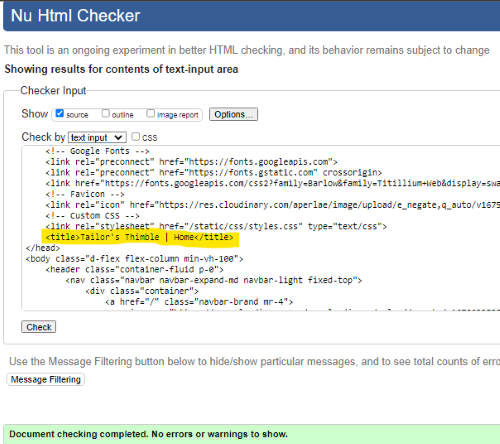

**ABOUT**

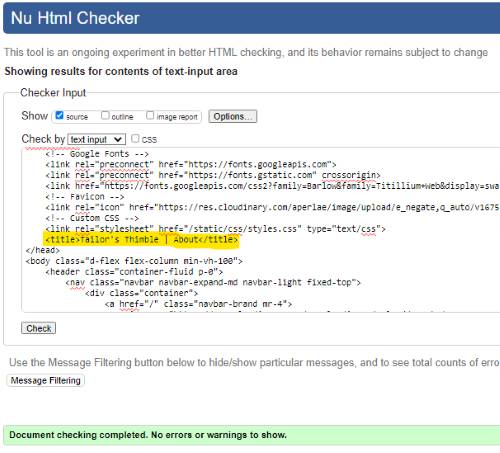

**SERVICES**

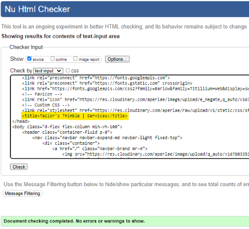

**SIGNUP/REGISTER**

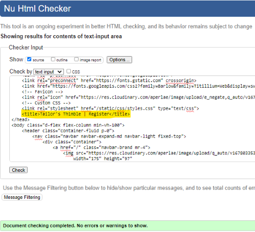

**LOGIN**

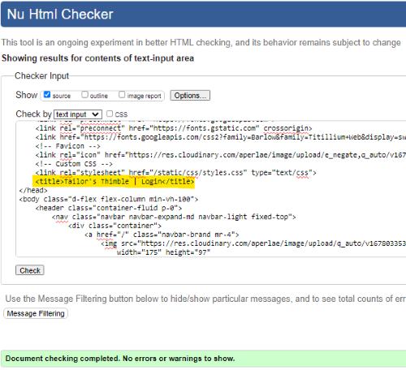

**PROFILE**

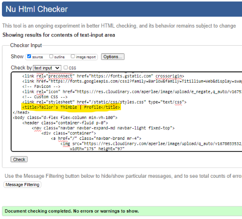

**LOGOUT**

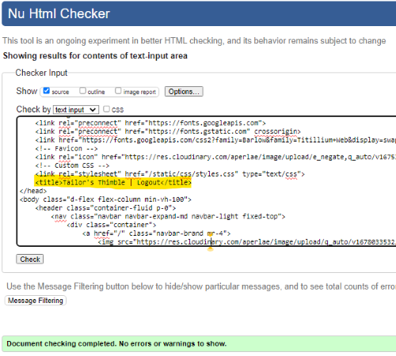

**APPOINTMENTS LIST**

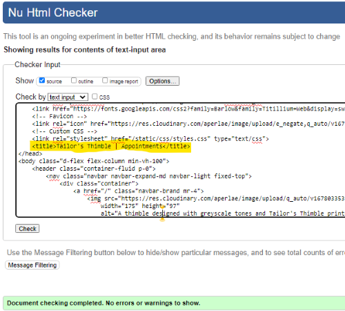

**APPOINTMENT CREATE**

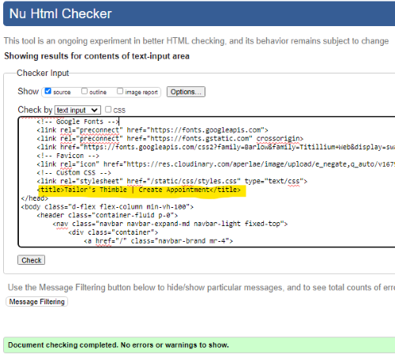

**APPOINTMENT READ**

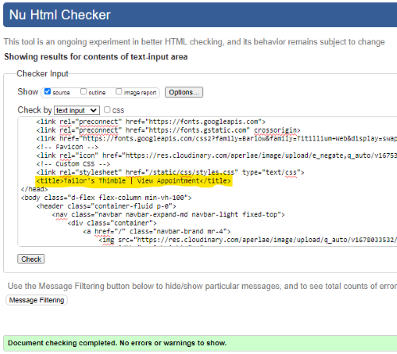

**APPOINTMENT UPDATE**

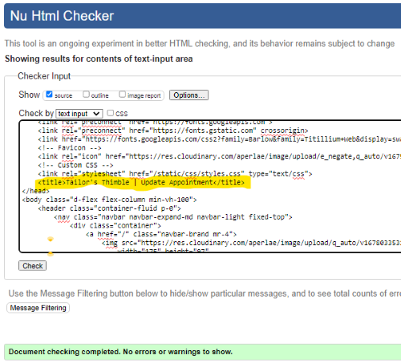

**APPOINTMENT DELETE**

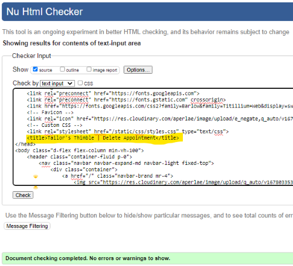

**403**

**404**

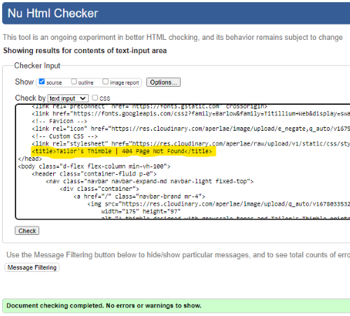

[Back To Top](#table-of-contents)

_____

### CSS

CSS code was tested using the [W3C CSS Validation Service](https://jigsaw.w3.org/css-validator/) via text input. 

Screenshot with results for the styles.css file

**styles.css**

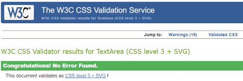

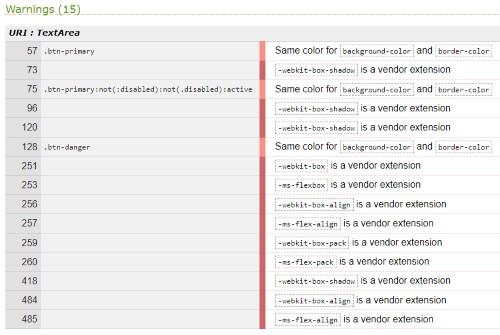

* 12 warnings due to vendor extension prefixes.  The CSS file was run through [Autoprefixer CSS Online](https://autoprefixer.github.io/) for browser support.
* 3 warnings due to having the same `background-color` and `border-color` on the same element.  This is essential since I am overriding Bootstrap's button classes.  A solution to this would be to use different class names for my custom buttons but because of time constraints this was not implemented at this time. 

 

[Back To Top](#table-of-contents)

_____

### Python

Python code was tested using [Code Institute's Python Linter](https://pep8ci.herokuapp.com/).

Screenshots and results for all python files

Long lines in `settings.py` and `env.py` were cleared using `# noqa`. These were values by the Django generated AUTH_PASSWORD_VALIDATORS, the values for STATICFILES_STORAGE and DEFAULT_FILE_STORAGE and the values for DATABASE_URL and CLOUDINARY_URL in the `env.py` file which were giving errors when separated into two lines.

**tailors_thimble**

* settings.py

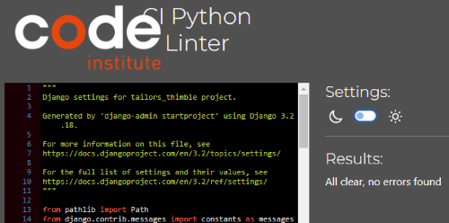

* urls.py

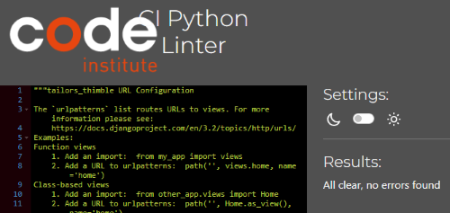

**users**

* admin.py

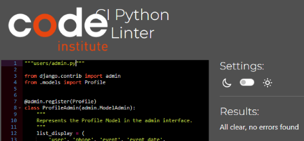

* apps.py

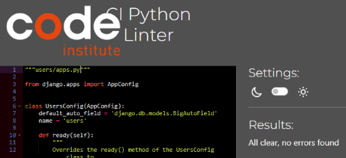

* forms.py

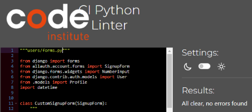

* models.py

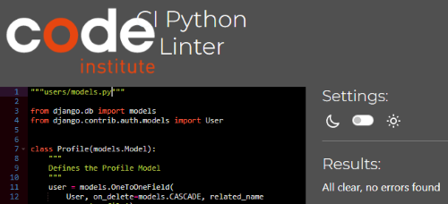

* signals.py

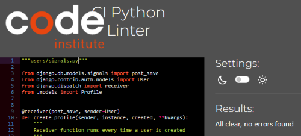

* views.py

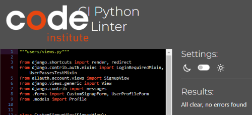

**tailoring**

* admin.py

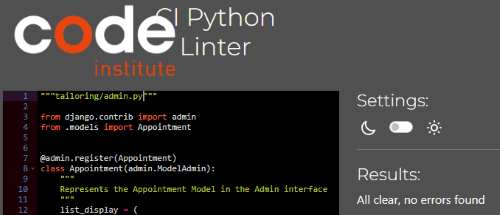

* constants.py

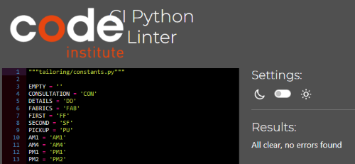

* forms.py

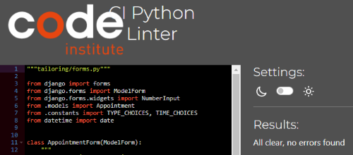

* models.py

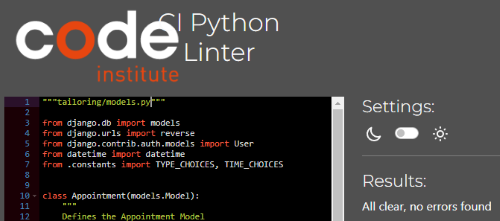

* urls.py

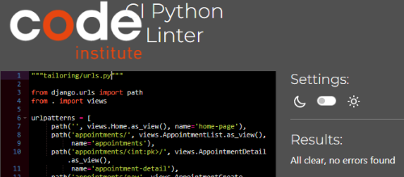

* views.py

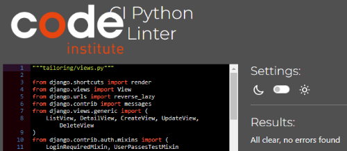

**root**

* env.py

 

[Back To Top](#table-of-contents)

_____

## Lighthouse Testing

[Lighthouse](https://developer.chrome.com/docs/lighthouse/overview/) was used to audit the website for performance, accessibility, best practice and SEO.  This was run in Chrome DevTools in incognito mode. 

Screenshots and results for all pages

 

**HOME**

* Mobile

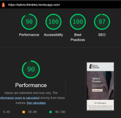

*Note*: After changing the service-img to scale up evenly for screens > 1200px, the test was run again and the performance dropped a little for mobile. Because of time constraints, it wasn't possible to investigate further at this time. 

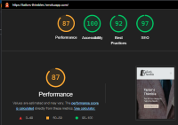

* Desktop

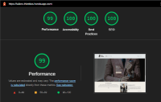

**ABOUT**

* Mobile

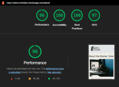

* Desktop

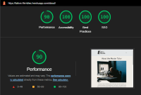

**SERVICES**

* Mobile

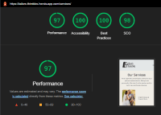

* Desktop

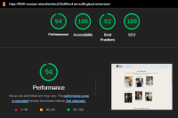

**SIGNIN/REGISTER**

* Mobile

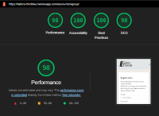

* Desktop

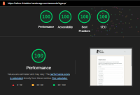

**LOGIN**

* Mobile

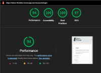

* Desktop

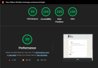

**PROFILE**

* Mobile

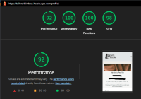

* Desktop

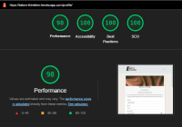

**LOGOUT**

* Mobile

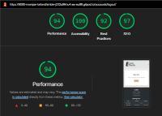

* Desktop

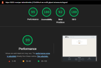

The following are the results for the Appointment pages

| Page | Device | Performance | Accessibility | Best Practice | SEO |
| ---- | ------ | ----------- | ------------- | ------------- | --- |
| Appointments w/o appointments | mobile  |  96 | 100 | 100 |  97 |
|                               | desktop | 100 | 100 | 100 | 100 |
| Appointments w/o profile | mobile  |  94 | 100 | 100 |  96 |
|                          | desktop | 100 | 100 | 100 | 100 |
| Appointments List        | mobile  |  95 | 100 | 100 |  97 |
|                          | desktop | 100 | 100 | 100 | 100 |
| Appointment Create       | mobile  |  94 | 100 |  92 |  98 |
|                          | desktop | 100 | 100 |  92 | 100 |
| Appointment Read         | mobile  |  98 | 100 | 100 |  97 |
|                          | desktop |  99 | 100 | 100 | 100 |
| Appointment Update       | mobile  |  98 | 100 | 100 |  98 |
|                          | desktop | 100 | 100 | 100 | 100 |
| Appointment Delete       | mobile  |  98 | 100 | 100 |  97 |
|                          | desktop |  99 | 100 | 100 | 100 |
 

[Back To Top](#table-of-contents)

_____

## Responsiveness Testing

The website is responsive for screens with a mininum width of 320px and a maximum width of 2560px. Friends and family tested the website on their devices and all reported no issues with responsiveness.  Further manual tests were done using Chrome's DevTools.

Screenshots of website at different screen sizes.

**NAVBAR & HOME HERO**

        Mobile - iPhone 320px

        Tablet - iPad Mini 768px

        Desktop - Nest Hub - 1024px

**FOOTER**

        Mobile - Galaxy S9+ - 320px
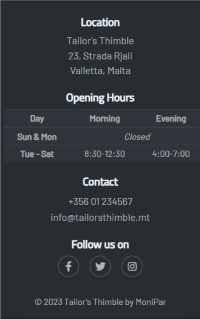

        Tablet - Surface Pro 7 - 912px
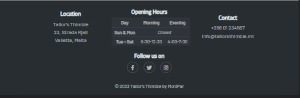

**HOME**

        Mobile - Galaxy S9 - 320px
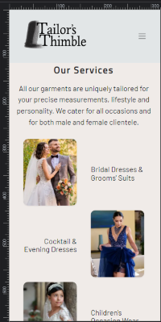

        Tablet - iPad - 768px
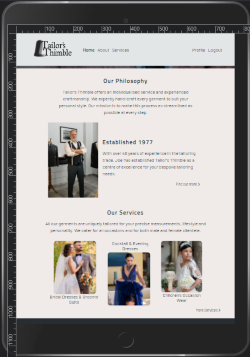
 
        Desktop - Nest Hub Max - 1280px
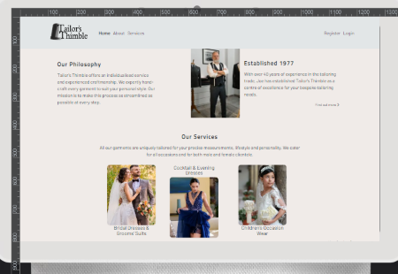

**ABOUT**

        Mobile - iPhone 12 Pro -390px
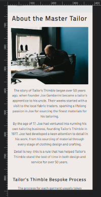

        Mobile - Samsung Galaxy S20 Ultra - 412px

        Tablet - iPad Air - 820px

        Desktop - Nest Hub Pro - 1200px

**SERVICES**

        Mobile - iPhone XR - 414px

        Tablet - Surface Pro 7 - 912px

        Desktop - Desktop - 1440px

**PROFILE**

        Mobile - iPhone 12 Pro - 800px

        Tablet - iPad Pro - 1200px

**APPOINTMENTS**

        Mobile - iPhone 6/7/8 - 375px

        Tablet - Surface Pro 7 - 912px

        Desktop - Nest Hub Max - 1200px

**ALL OTHER PAGES**

All other pages have been tested with DevTools and results have been recorded in the table below which checks if the cards are clear and visible on mobile and if they are horizontally aligned on Tablet and Desktop.

| Page | Mobile | Tablet | Desktop |
| ---- | ------ | ------ | ------- |
| Register | Yes | Yes | Yes |
| Login | Yes | Yes | Yes |
| Logout | Yes | Yes | Yes | 
| Appt Detail | Yes | Yes | Yes |
| Appt Create | Yes | Yes | Yes |
| Appt Update | Yes | Yes | Yes |
| Appt Delete | Yes | Yes | Yes |
 

[Back To Top](#table-of-contents)

_____

## Browser Compatibilty Testing

Website was tested on current Chrome, Firefox, Edge, Brave for compatibility.  It was also tested on Safari on an iPad running on iOS 12.5.7 and an iPhone on the latest iOS.  

Table of the results.

| Intended | Chrome | Firefox | Edge | Brave | Safari iOS 12 | Safari iOS 15 |
| -------- | ------ | ------- | ---- | ----- | ------------- | ------------- |
| Appearance | Good | Good | Good | Good | Poor | Good |
| Responsiveness | Good | Good | Good | Good | Fair | Good |

The issue with using Safari on iOS 12 is that it doesn't support webp images, therefore all webP images were not visible.

[Back To Top](#table-of-contents)

_____

## User Story Testing

### Epic 3 - Home Page

* User Story [#6](https://github.com/MoniPar/tailors_thimble/issues/6)

As a business owner, I would like users visiting our site to land on the homepage so that they can learn about us and the services we provide.

| Acceptance Criteria  | Test     | Comments |
|:--------------------:|:--------:| -------- |
| Website URL directs users to the homepage | Achieved | |
| Homepage has some basic information about the business | Achieved | |

* User Story [#7](https://github.com/MoniPar/tailors_thimble/issues/7)

As a User, I can see the website's logo and links at the top of the page so that I can easily navigate to other parts of the website.

| Acceptance Criteria  | Test     | Comments |
|:--------------------:|:--------:| -------- |
| Header with Tailor's Thimble logo is displayed | Achieved | |
| Links to Home, About, Services, Register and Login pages are displayed | Achieved | |
| Hamburger button for mobile toggles navbar links. | Achieved | |

* User Story [#8](https://github.com/MoniPar/tailors_thimble/issues/8)

As a User, I can see contact details, shop address and social links at the bottom of the website so that I can follow/contact the business owner and the website creator.

| Acceptance Criteria  | Test     | Comments |
|:--------------------:|:--------:| -------- |
| A footer is displayed at the bottom of the page | Achieved | |
| Contact details, social links and shop address are clearly displayed | Achieved | |
| Copyright date and link to the website creator's Linkedin page | Achieved | |
| All footer links open in a new tab | Achieved | | 

* User Story [#9](https://github.com/MoniPar/tailors_thimble/issues/9)

As a Business Owner, I would like the homepage to have a Call to Action so that users are encouraged to schedule an appointment early on.

| Acceptance Criteria  | Test     | Comments |
|:--------------------:|:--------:| -------- |
| A hero image that draws the eye to the Schedule an Appointment button | Achieved | |
| Some text about the Bespoke Tailoring Experience | Achieved | |
| A visible Schedule an Appointment button which will eventually link to the Booking form | Achieved | Schedule Appointments button links to the Appointments Page which has a button to create appointments |

* User Story [#10](https://github.com/MoniPar/tailors_thimble/issues/10) 

As a User, I can read about the people behind the business so that I can make up my mind if I feel comfortable using their service.

| Acceptance Criteria  | Test     | Comments |
|:--------------------:|:--------:| -------- |
| A short section about the tailor | Achieved | |
| An image of the tailor | Achieved | Image is visible on screens > 768px |
| A read more button that links to the About page when clicked | Achieved |

* User Story [#11](https://github.com/MoniPar/tailors_thimble/issues/11)

As a Business Owner, I can display some of the services we provide on the Homepage so that it gives the user an idea of the type of services we offer.

| Acceptance Criteria  | Test     | Comments |
|:--------------------:|:--------:| -------- |
| A services section which displays 2 or 3 different types of services | Achieved | |
| Icons or images to give a bit of visual feedback | Achieved | |
| A read more link that links to the Services page | Achieved | |

## Epic 4 - Other Frontend

* User Story [#12](https://github.com/MoniPar/tailors_thimble/issues/12)

As a Developer, I can have a favicon added to the tab and website's title so that it gives users more visual feedback when looking at their tabs on their browser.

| Acceptance Criteria  | Test     | Comments |
|:--------------------:|:--------:| -------- |
| A representative image from the Tailor's Thimble logo is visible on the title tab | Achieved | |

* User Story [#13](https://github.com/MoniPar/tailors_thimble/issues/13)

As a User, I can easily navigate to the About page so that I can find more information about the people behind the business and how they operate.

| Acceptance Criteria  | Test     | Comments |
|:--------------------:|:--------:| -------- |
| More information about the Master Tailor and his experience in the craft | Achieved | | 
| A section about the process of Bespoke Tailoring with images | Achieved | |
| Another Call to Action with link to the Appointment form | Achieved | Link directs logged in users to the Appointments Page which has a button to the Appointment Form |  

* User Story [#14](https://github.com/MoniPar/tailors_thimble/issues/14)

As a User, I can easily navigate to the Services page so that I can find more information about the kind of work the business caters for. 

| Acceptance Criteria  | Test     | Comments |
|:--------------------:|:--------:| -------- |
| More services and images | Achieved | |
| A short note about the duration of the process uring clients to book their appointments early | Achieved | | 
| A call to action with link to Appointment form | Achieved | Link directs logged in users to the Appointments Page which has a button to the Appointment Form |

### Epic 5 - Admin Panel

* User Story [#15](https://github.com/MoniPar/tailors_thimble/issues/15)

As a Business Owner, I can login, view customers' info and appointments scheduled so that I can contact them back for approval/dismissal.

| Acceptance Criteria  | Test     | Comments |
|:--------------------:|:--------:| -------- |
| Admin has the facility to login to the Admin Panel | Achieved | Business owner can access the Admin panel via url |
| Admin can view, update and delete customers' details and appointments | Achieved | | 
| Admin can approve or dismiss appointments set by the customer | Achieved | Admin can approve appointments. If customer has set the wrong appointment they are contacted by email or phone |  

### Epic 6 - User Registration & Authentication

* User Story [#16](https://github.com/MoniPar/tailors_thimble/issues/16)

As a User, I can register an account so that I can make an appointment with the Master Tailor.

| Acceptance Criteria  | Test     | Comments |
|:--------------------:|:--------:| -------- |
| A new user is directed to the Registration form when they click the Schedule Appointment button | Changed | Directed to Login page with a link to Registration |
| The form has fields for username, email, password and a submit button | Updated | First and last name fields were also added to Registration form|
| Upon clicking the submit button, the user is redirected to the Homepage | Changed | Upon clicking the submit button, the user is directed to the Profile page | 

* User Story [#17](https://github.com/MoniPar/tailors_thimble/issues/17)

As a Returning User, I can use my username and password so that I can login to my user account.

| Acceptance Criteria  | Test     | Comments |
|:--------------------:|:--------:| -------- |
| Users are directed to the Login form when they click on the Login link in the navbar | Achieved | |
| Users can also login through the link in the registration form upon clicking the Schedule Appointment button | Updated | Upon clicking the Schedule Appointment button, users are directed to the Login form | 
| Users are asked for their Username and Password | Achieved | | 
| After login, users are directed back to the Home page | Updated | Users logging in through Schedule Appointment button are directed to their Appointments Page. Users logging in through the navbar login link are directed to their Profile Page which has a button to their Appointments Page |

* User Story [#18](https://github.com/MoniPar/tailors_thimble/issues/18)

As a User, I can log out of my account so that I can keep my details secure.

| Acceptance Criteria  | Test     | Comments |
|:--------------------:|:--------:| -------- |
| When user is logged in, the logout link appears in the navbar | Achieved | |
| When logout link is clicked, user is directed to the logout page | Achieved | |
| The logout confirms with the user that they are signing out | Changed | The logout confirms with the user that they are logging out |
| When the user confirms by clicking the Sign Out button, they are redirected to the Home Page | Changed | When the user confirms by clicking the Log Out button, they are redirected to the Home Page |

* User Story [#19](https://github.com/MoniPar/tailors_thimble/issues/19)

As a developer, I can display success and error messages upon form submission so that the user has a better experience with the site.

| Acceptance Criteria  | Test     | Comments |
|:--------------------:|:--------:| -------- |
| Success or error alerts are displayed at the top of the page whenever user submits a form | Achieved | |
| These alerts are colour coded and clear | Achieved | | 

### Epic 7 - User Profile

* User Story [#20](https://github.com/MoniPar/tailors_thimble/issues/20)

As a Returning User, I can login to my profile so that I can access my information and view my details.

| Acceptance Criteria  | Test     | Comments |
|:--------------------:|:--------:| -------- |
| When returning user logs into their account, a profile link appears in the navbar | Achieved | | 
| When the profile link is clicked, the user will be directed to the Profile page | Achieved | | 
| Only the logged in user is able to view his/her Profile page | Achieved |

* User Story [#21](https://github.com/MoniPar/tailors_thimble/issues/21)

As a Developer, I can automate user profile creation upon registration so that the admin doesn't have to do it manually every time a new user is registered.

| Acceptance Criteria  | Test     | Comments |
|:--------------------:|:--------:| -------- |
| The Profile page is populated with more fields consisting of information the business owner needs | Achieved | |
| This includes a phone number, event date, event and outfit type | Achieved | |
| A newly registered user is directed to their profile page where they can view their information after registration | Achieved | |

* User Story [#23](https://github.com/MoniPar/tailors_thimble/issues/23)

As a User, I can update my profile information so that I can change my details when necessary.

| Acceptance Criteria  | Test     | Comments |
|:--------------------:|:--------:| -------- |
| The Profile page is an editable form populated with the user's information | Achieved | |
| It can only be accessed by the logged in user | Achieved | |
| The user is able to update their information and submit the form via the Update button | Achieved | |
| Form is validated before saved and the user is aleerted to required fields/invalid input | Achieved | | 
| User is directed back to the Profile page after successful update, showing the updated information | Changed | After successful update, the user is redirected to the Home page were the Schedul Appointment button is clearly visible |

* User Story [#24](https://github.com/MoniPar/tailors_thimble/issues/24)

As a Developer, I can have placeholder text in the profile form so that users have a better experience filling in their forms.

| Acceptance Criteria  | Test     | Comments |
|:--------------------:|:--------:| -------- |
| Empty fields have helpful hints to guide users | Updated | Tooltips were also added to give a little more guidance |

### Epic 8 - Appointments

* User Story [#25](https://github.com/MoniPar/tailors_thimble/issues/25)

As a Business Owner, I can login and view appointments scheduled by my customers so that I can contact them back for approval/dismissal.

| Acceptance Criteria  | Test     | Comments |
|:--------------------:|:--------:| -------- |
| Admin has the facility to view the Appointments table in the Admin page | Achieved | Admin/the business owner can access the admin page through the url and login using their superuser credentials |
| Appointment table displays the appointment type, date and time, the date submitted, the state of approval and any comments left by the customer | Achieved | The appointment table also displays the customer's username | 
| Admin can approve or dismiss appointments set by the customer | Achieved | Admin/Business owner can approve appointments or leave them unchecked |

* User Story [#26](https://github.com/MoniPar/tailors_thimble/issues/26)

As a Returning User, I can login and view my appointments so that I can check if my appointments have been approved.

| Acceptance Criteria  | Test     | Comments |
|:--------------------:|:--------:| -------- |
| User can see their past and future appointments listed | Achieved | A user who has already created appointments can see them listed on the Appointments page |
| User can check if their future appointments have been approved | Achieved | |

* User Story [#27](https://github.com/MoniPar/tailors_thimble/issues/27)

As a Returning User, I can schedule an appointment with the Master Tailor so that I can avail of their services.

| Acceptance Criteria  | Test     | Comments |
|:--------------------:|:--------:| -------- |
| Logged in user can click on the Add Appointment button to book a new appointment | Achieved | |
| Appointment form has the necessary fields to complete appointment schedule | Achieved | Appointment form has fields for Type, Date, Time, and optional Comments |
| Form has information to guide the user on how to schedule an appointment | Achieved | Form has also link that opens in another tab on the Process guidelines | 
| Submit button directs users to the Appointments page which shows all scheduled appointments | Achieved | | 

* User Story [#28](https://github.com/MoniPar/tailors_thimble/issues/28)

As a Returning User, I can update my appointment so that I can make sure of my availability

| Acceptance Criteria  | Test     | Comments |
|:--------------------:|:--------:| -------- |
| User is directed to the Update form when they click on the Edit appointment button | Updated | In Appointment detail view, user is directed to the Update form when they click on the Update button |
| Appointment Update form has fields for date/time and comments | Updated | Appointment Update form has fields for Type, Date, Time and optional comments |
| User is directed back the their Appointment page after clicking the Submit button | Achieved | |

* User Story [#29](https://github.com/MoniPar/tailors_thimble/issues/29)

As a Returning User, I can delete my upcoming appointment so that I can reschedule at a later date.

| Acceptance Criteria  | Test     | Comments |
|:--------------------:|:--------:| -------- |
| User can delete an appointment from the Appointment Detail page | Achieved | |
| When user clicks on delete button, they are directed to a confirmation page with Delete and Cancel buttons | Achieved | Delete Confirmation page asks user if they are sure they want to delete this appointment |
| If user clicks Cancel, they are brought back to the Appointment Detail page of the current appointment | Achieved | |
| If user clicks Delete, the appointment is deleted and user is directed back to the Appointments page | Achieved | |

* User Story [#30](https://github.com/MoniPar/tailors_thimble/issues/30)

As a developer, I can restrict access on users' appointments so that only the logged in user and admin are able to access, update and delete said user's appointments.

| Acceptance Criteria  | Test     | Comments |
|:--------------------:|:--------:| -------- |
| A 403 Forbidden is thrown when users try to access, other users appointments through the URL address bar | Achieved | |
| The 403 page is customised so that navigation and footer are included in order for the user to be able to easily navigate to other parts of the website | Achieved | | 

[Back To Top](#table-of-contents)

_____

## Other Features Testing

[Back To Top](#table-of-contents)

