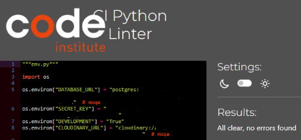

# Table of Contents

* [Code Validation](#code-validation)
* [Lighthouse](#lighthouse-testing)
* [Responsiveness](#responsiveness-testing)
* [Browser Compatibility](#browser-compatibilty-testing)
* [User Stories](#user-story-testing)
* [Other Features](#other-features-testing)

_____

## Code Validation

### HTML

HTML code was tested using the [W3C Validator](https://validator.w3.org/) via text input.  The HTML code was copied and pasted in from each page of the website's source code.

Screenshots and results for all templates.

 

**HOME**

**ABOUT**

**SERVICES**

**SIGNUP/REGISTER**

**LOGIN**

**PROFILE**

**LOGOUT**

**APPOINTMENTS LIST**

**APPOINTMENT CREATE**

**APPOINTMENT READ**

**APPOINTMENT UPDATE**

**APPOINTMENT DELETE**

**403**

**404**

[Back To Top](#table-of-contents)

_____

### CSS

CSS code was tested using the [W3C CSS Validation Service](https://jigsaw.w3.org/css-validator/) via text input. 

Screenshot with results for the styles.css file

**styles.css**

* 12 warnings due to vendor extension prefixes.  The CSS file was run through [Autoprefixer CSS Online](https://autoprefixer.github.io/) for browser support.
* 3 warnings due to having the same `background-color` and `border-color` on the same element.  This is essential since I am overriding Bootstrap's button classes.  A solution to this would be to use different class names for my custom buttons but because of time constraints this was not implemented at this time. 

 

[Back To Top](#table-of-contents)

_____

### Python

Python code was tested using [Code Institute's Python Linter](https://pep8ci.herokuapp.com/).

Screenshots and results for all python files

Long lines in `settings.py` and `env.py` were cleared using `# noqa`. These were values by the Django generated AUTH_PASSWORD_VALIDATORS, the values for STATICFILES_STORAGE and DEFAULT_FILE_STORAGE and the values for DATABASE_URL and CLOUDINARY_URL in the `env.py` file which were giving errors when separated into two lines.

**tailors_thimble**

* settings.py

* urls.py

**users**

* admin.py

* apps.py

* forms.py

* models.py

* signals.py

* views.py

**tailoring**

* admin.py

* constants.py

* forms.py

* models.py

* urls.py

* views.py

**root**

* env.py

 

[Back To Top](#table-of-contents)

_____

## Lighthouse Testing

[Lighthouse](https://developer.chrome.com/docs/lighthouse/overview/) was used to audit the website for performance, accessibility, best practice and SEO.  This was run in Chrome DevTools in incognito mode. 

Screenshots and results for all pages

 

**HOME**

* Mobile

*Note*: After changing the service-img to scale up evenly for screens > 1200px, the test was run again and the performance dropped a little for mobile. Because of time constraints, it wasn't possible to investigate further at this time. 

* Desktop

**ABOUT**

* Mobile

* Desktop

**SERVICES**

* Mobile

* Desktop

**SIGNIN/REGISTER**

* Mobile

* Desktop

**LOGIN**

* Mobile

* Desktop

**PROFILE**

* Mobile

* Desktop

**LOGOUT**

* Mobile

* Desktop

The following are the results for the Appointment pages

| Page | Device | Performance | Accessibility | Best Practice | SEO |
| ---- | ------ | ----------- | ------------- | ------------- | --- |
| Appointments w/o appointments | mobile  |  96 | 100 | 100 |  97 |
|                               | desktop | 100 | 100 | 100 | 100 |
| Appointments w/o profile | mobile  |  94 | 100 | 100 |  96 |
|                          | desktop | 100 | 100 | 100 | 100 |
| Appointments List        | mobile  |  95 | 100 | 100 |  97 |
|                          | desktop | 100 | 100 | 100 | 100 |
| Appointment Create       | mobile  |  94 | 100 |  92 |  98 |
|                          | desktop | 100 | 100 |  92 | 100 |
| Appointment Read         | mobile  |  98 | 100 | 100 |  97 |
|                          | desktop |  99 | 100 | 100 | 100 |
| Appointment Update       | mobile  |  98 | 100 | 100 |  98 |
|                          | desktop | 100 | 100 | 100 | 100 |
| Appointment Delete       | mobile  |  98 | 100 | 100 |  97 |
|                          | desktop |  99 | 100 | 100 | 100 |
 

[Back To Top](#table-of-contents)

_____

## Responsiveness Testing

The website is responsive for screens with a mininum width of 320px and a maximum width of 2560px. Friends and family tested the website on their devices and all reported no issues with responsiveness.  Further manual tests were done using Chrome's DevTools.

Screenshots of website at different screen sizes.

**NAVBAR & HOME HERO**

        Mobile - iPhone 320px

        Tablet - iPad Mini 768px

        Desktop - Nest Hub - 1024px

**FOOTER**

        Mobile - Galaxy S9+ - 320px

        Tablet - Surface Pro 7 - 912px

**HOME**

        Mobile - Galaxy S9 - 320px

        Tablet - iPad - 768px

 
        Desktop - Nest Hub Max - 1280px

**ABOUT**

        Mobile - iPhone 12 Pro -390px

        Mobile - Samsung Galaxy S20 Ultra - 412px

        Tablet - iPad Air - 820px

        Desktop - Nest Hub Pro - 1200px

**SERVICES**

        Mobile - iPhone XR - 414px

        Tablet - Surface Pro 7 - 912px

        Desktop - Desktop - 1440px

**PROFILE**

        Mobile - iPhone 12 Pro - 800px

        Tablet - iPad Pro - 1200px

**APPOINTMENTS**

        Mobile - iPhone 6/7/8 - 375px

        Tablet - Surface Pro 7 - 912px

        Desktop - Nest Hub Max - 1200px

**ALL OTHER PAGES**

All other pages have been tested with DevTools and results have been recorded in the table below which checks if the cards are clear and visible on mobile and if they are horizontally aligned on Tablet and Desktop.

| Page | Mobile | Tablet | Desktop |
| ---- | ------ | ------ | ------- |
| Register | Yes | Yes | Yes |
| Login | Yes | Yes | Yes |
| Logout | Yes | Yes | Yes | 
| Appt Detail | Yes | Yes | Yes |
| Appt Create | Yes | Yes | Yes |
| Appt Update | Yes | Yes | Yes |
| Appt Delete | Yes | Yes | Yes |
 

[Back To Top](#table-of-contents)

_____

## Browser Compatibilty Testing

Website was tested on current Chrome, Firefox, Edge, Brave for compatibility.  It was also tested on Safari on an iPad running on iOS 12.5.7 and an iPhone on the latest iOS.  

Table of the results.

| Intended | Chrome | Firefox | Edge | Brave | Safari iOS 12 | Safari iOS 15 |
| -------- | ------ | ------- | ---- | ----- | ------------- | ------------- |
| Appearance | Good | Good | Good | Good | Poor | Good |
| Responsiveness | Good | Good | Good | Good | Fair | Good |

The issue with using Safari on iOS 12 is that it doesn't support webp images, therefore all webP images were not visible.

[Back To Top](#table-of-contents)

_____

## User Story Testing

[Back To Top](#table-of-contents)

_____

## Other Features Testing

[Back To Top](#table-of-contents)

